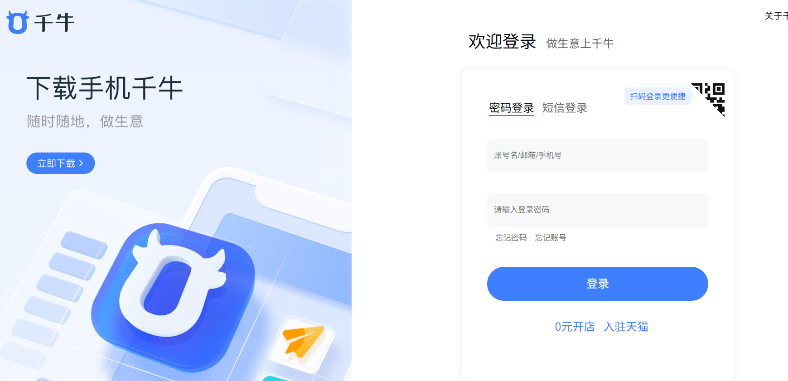
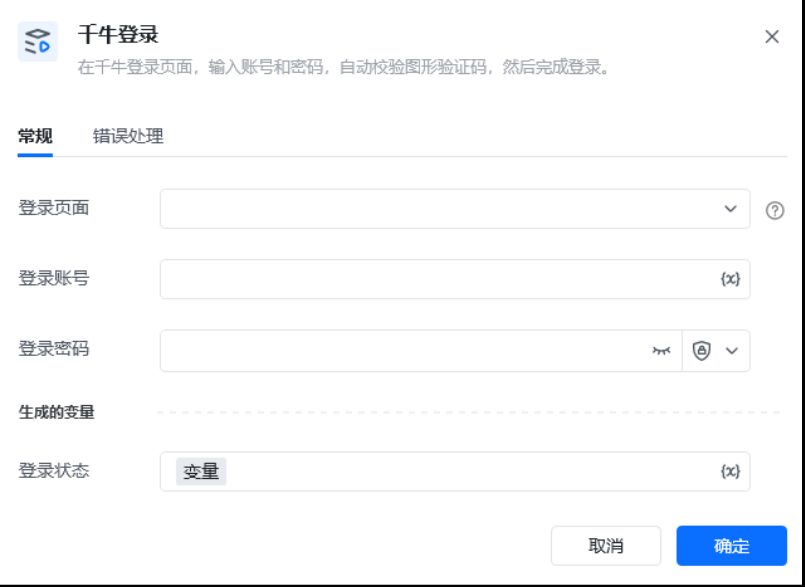

输入登录页面：传入千牛登录网页对象。登录账号：输入登录账号。登录密码：输入登录密码。
输出登录状态：成功返回true、失败返回false。
# 操作说明
## 1、传入https://loginmyseller.taobao.com/网页对象，填写账号密码。

## 2、输出结果

登录成功返回true、失败返回false

若登录失败会打印以下异常信息：账号或密码输入错误，请重新输入。需要手机短信验证身份。滑块验证失败。其它未知异常。

<Info>
  使用指令过程中遇到问题？前往 [八爪鱼RPA 开发者社区问答板块](https://rpa.bazhuayu.com/community/questions) 提问，获取官方与社区帮助。
</Info>
