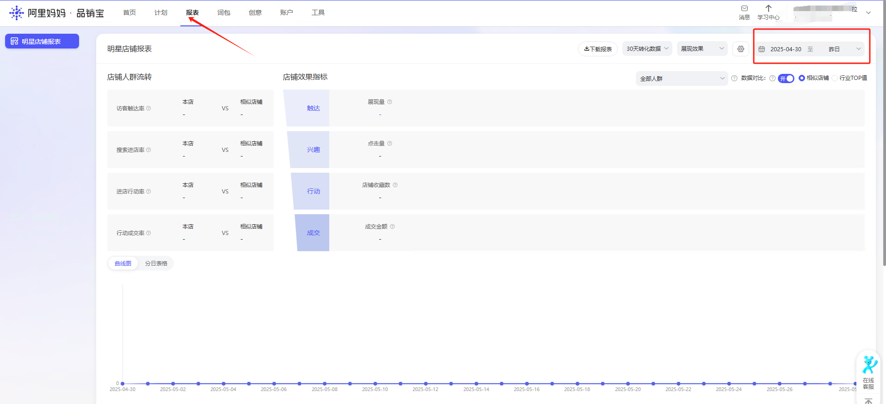

# 输入

•网页对象 web_page

•日期
# 输出

•无输出
# 使用说明
## 1、使用该指令前需要打开到阿里妈妈-品销宝的报表页面

进行日期范围的选择，并确认。

<Info>
  使用指令过程中遇到问题？前往 [八爪鱼RPA 开发者社区问答板块](https://rpa.bazhuayu.com/community/questions) 提问，获取官方与社区帮助。
</Info>
