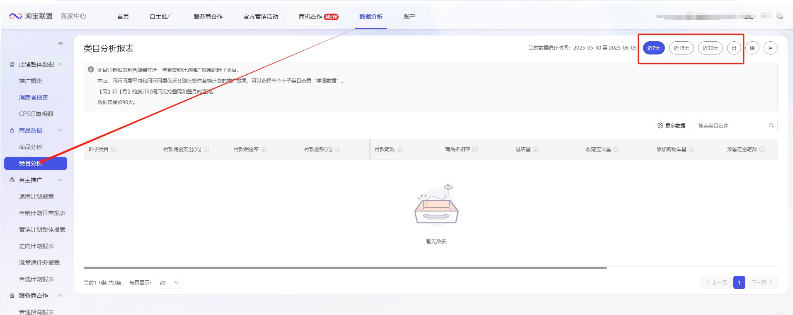

# 输入

•网页对象： web_page

•快捷日期选择：可以下拉框快捷选择“近7天”、“近15天”、“近30天”选项；若选择“自定义日期”，需要填写自定义日期参数yyyy-mm-dd。

•自定义日期范围：“自定义日期”日期格式必须为：yyyy-mm-dd，如2025-05-06；注意网页页面仅支持查询近90天的数据。

# 输出

•无输出
# 使用说明
## 1、使用该指令前需要打开到淘宝联盟-商家中心-数据分析-类目分析 页面

https://ad.alimama.com/portal/v2/report/category/list.htm?pageNo=1

进行日期范围的选择，并确认。

<Info>
  使用指令过程中遇到问题？前往 [八爪鱼RPA 开发者社区问答板块](https://rpa.bazhuayu.com/community/questions) 提问，获取官方与社区帮助。
</Info>
