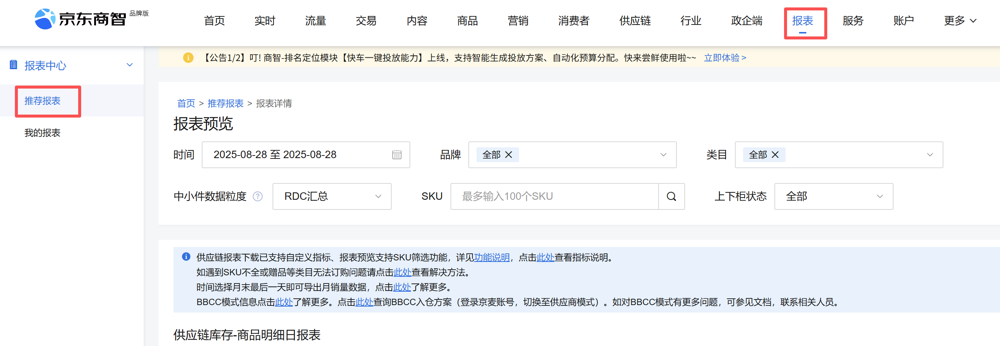
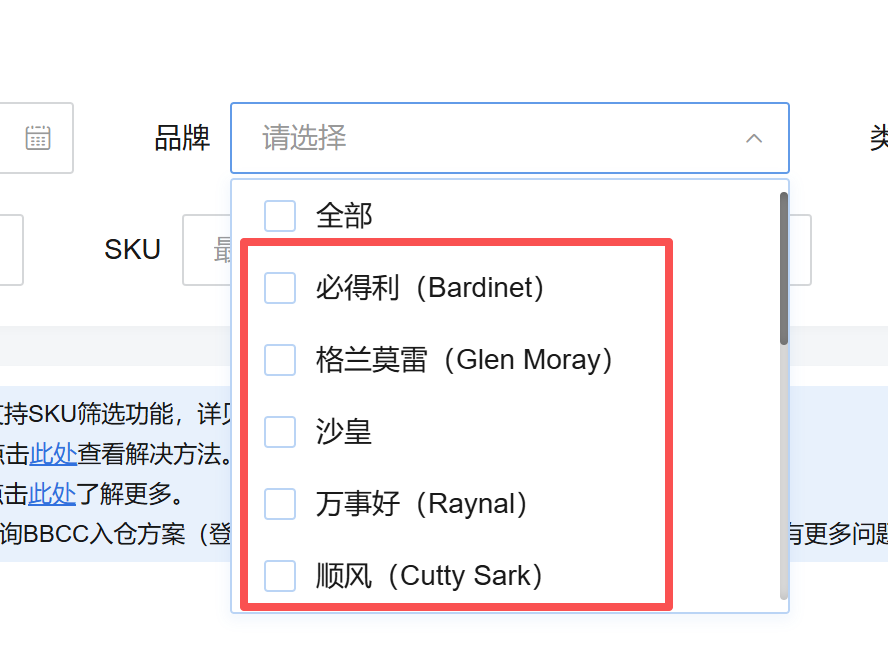
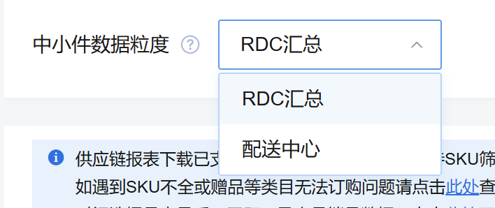
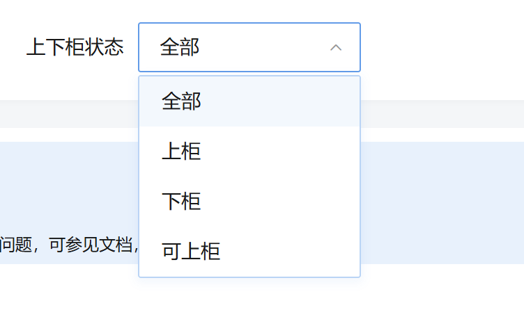
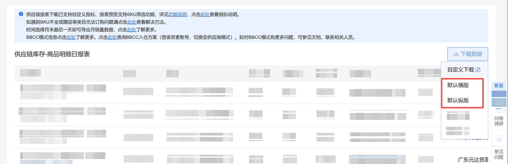

# 描述

该指令实现报表-推荐报表-供应链库存商品明细日报表按时间等条件筛选后下载报表

# <strong>输入</strong>
### <strong>网页对象：</strong>

任意一个已登录京东商智品牌版后台的报表预览页面的网页对象

### 时间：

输入时间，格式: YYYY-M-D，例如: 2025-8-1, 选填，若不填则使用网站默认时间(T-1)
### 品牌列表：

输入列表格式，列表每项为品牌名称，注意：品牌名称需要与网站显示的名称完全一致（包含符号的中英文状态、字母大小写等），否则可能导致无法选择。选填，若不填则默认全部

### 一级类目：

填写一级类目名称，填写后将出现二级类目输入框。注意：类目名称需要与网站显示的名称完全一致（包含符号的中英文状态、字母大小写等），否则可能导致无法选择。选填，若不填则默认一级全部
### 二级类目：

填写二级类目名称，填写后将出现三级类目输入框。注意：类目名称需要与网站显示的名称完全一致（包含符号的中英文状态、字母大小写等），否则可能导致无法选择。选填，若不填则默认二级全部
### 三级类目：

填写三级类目名称。选填，注意：类目名称需要与网站显示的名称完全一致（包含符号的中英文状态、字母大小写等），否则可能导致无法选择。若不填则默认三级全部
### 中小件数据粒度：

下拉框, 可选: RDC汇总、配送中心

### 上下柜状态：

下拉框, 可选: 全部、上柜、下柜、可上柜

### 下载方式：

下拉框，可选择: 默认横版、默认纵版

### 文件下载路径：

下载文件保存的文件夹路径
### 自定义文件名：

下载的文件名，选填，若不填则使用默认文件名
# 输出
### 文件路径：

<Info>
  使用指令过程中遇到问题？前往 [八爪鱼RPA 开发者社区问答板块](https://rpa.bazhuayu.com/community/questions) 提问，获取官方与社区帮助。
</Info>
