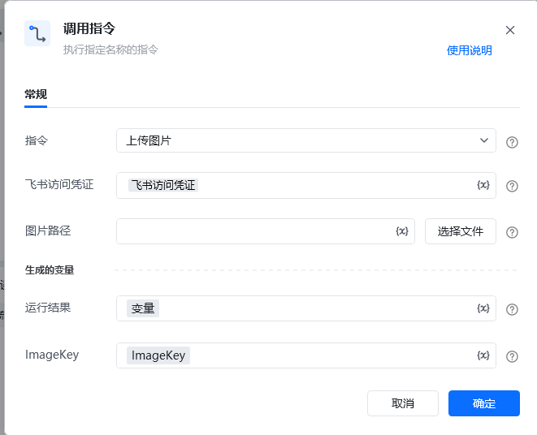

## <strong>一、指令概述</strong>

该 RPA 指令用于<strong>将本地图片上传至飞书</strong>，通过飞书访问凭证完成认证，上传成功后会生成图片在飞书的唯一标识 ImageKey 及运行结果，便于后续流程（如 “发送消息” 指令中引用图片）使用。

飞书官方开发文档参考：https://open.feishu.cn/document/server-docs/im-v1/image/create
## <strong>二、调用参数配置示意</strong>

参数名称示例 / 默认值说明指令上传图片固定选择 “上传图片”，表示执行飞书图片上传操作。飞书访问凭证飞书访问凭证配置飞书开放平台的访问凭证（需具备图片上传权限，可通过 “获取飞书访问凭证” 指令生成），支持变量（界面显示 “\{x\}” 标识）。图片路径（如 “C:\Images\report.png”）输入要上传的本地图片文件路径；可点击「选择文件」按钮选取本地图片，支持变量。生成的变量 - 运行结果变量（自定义变量名）存储图片上传的执行结果（如成功状态、错误信息等，对应飞书 API 返回的完整响应），需配置为自定义变量，后续流程可调用，支持变量。生成的变量 - ImageKeyImageKey（自定义变量名）存储上传后图片在飞书的唯一标识（对应飞书 API 返回的image_key字段），用于后续发送图片消息等场景引用该图片，需配置为自定义变量，支持变量。
## <strong>三、使用示例（上传报表截图场景）</strong>
### <strong>场景：将本地路径为 “C:\Reports\2025Q3_sales.png” 的报表截图上传至飞书，获取 ImageKey 用于后续发送。</strong>
#### <strong>参数配置：</strong>

• 指令：上传图片

• 飞书访问凭证：feishuAuthToken（通过 “获取飞书访问凭证” 指令生成的变量）

• 图片路径：C:\Reports\2025Q3_sales.png（或通过「选择文件」选取）

• 运行结果：uploadResult（自定义变量，存储上传结果的完整 API 响应）

• ImageKey：salesReportImgKey（自定义变量，存储图片唯一标识image_key）
#### <strong>执行流程：</strong>

调用该 RPA 指令后，RPA 会通过 feishuAuthToken 完成飞书 API 认证，读取本地路径的报表截图并上传至飞书；上传完成后，将飞书 API 返回的完整响应存入 uploadResult，并提取响应中的image_key赋值给 salesReportImgKey。后续可在 “发送消息” 指令中，引用 salesReportImgKey 作为 “文件 / 图片 Key” 发送该图片。
## <strong>四、返回结果说明</strong>
### <strong>1. 飞书 API 标准响应示例（成功场景）：</strong>

指令执行后，“运行结果” 变量（如uploadResult）会存储飞书 API 返回的完整 JSON 响应，格式如下：

\{ "code": 0, "data": \{ "image_key": "img_v2_xxx" // 图片在飞书的唯一标识，与RPA中的ImageKey变量对应 \}, "msg": "success"\}
### <strong>2. 响应字段含义：</strong>

• code：状态码，0 表示上传成功，非 0 为失败（具体错误码含义可参考飞书官方开发文档）。

• msg：提示信息，success 表示上传成功，失败时会返回具体错误描述（如 “权限不足”“文件格式错误”）。

• data：核心返回数据，包含 image_key 字段 —— 即图片在飞书的唯一标识，RPA 会自动提取该字段值存入 “生成的变量 - ImageKey”（如salesReportImgKey）。
### <strong>3. ImageKey 结果：</strong>

“生成的变量 - ImageKey”（如salesReportImgKey）会被直接赋值为响应中的image_key字符串（如img_v2_xxx），后续可通过该标识在飞书内定位并使用这张图片。
## <strong>五、注意事项</strong>

1. <strong>访问凭证有效性</strong>：“飞书访问凭证” 需具备<strong>图片上传权限</strong>且未过期（建议通过 “获取飞书访问凭证” 指令动态生成有效凭证），否则会因权限不足或凭证失效导致上传失败（对应 API 响应code≠0，msg会提示具体原因）。

2. <strong>图片路径合法性</strong>：“图片路径” 需指向本地<strong>真实存在的图片文件</strong>（格式支持 PNG、JPG、JPEG 等飞书 API 兼容格式，具体可参考官方文档），否则会因 “文件不存在”“格式不支持” 报错。

3. <strong>变量与 API 响应关联</strong>：“生成的变量 - ImageKey” 是从 API 响应的data.image_key字段提取的，需确保变量配置正确，避免因字段匹配错误导致无法获取标识。

4. <strong>后续场景联动</strong>：上传成功后，ImageKey（即image_key）可直接用于 “发送消息” 指令的 “文件 / 图片 Key” 参数，实现 “上传图片 → 发送图片消息” 的自动化闭环，无需额外转换格式。
## <strong>六、延伸应用</strong>

可结合 RPA 的 “发送消息” 指令与 “定时触发” 指令，实现<strong>定时上传 + 发送图片</strong>的自动化流程：例如每日凌晨自动读取本地生成的业务报表截图（如 “C:\DailyReports\20250930_sales.png”），调用本指令上传至飞书并获取ImageKey，再通过 “发送消息” 指令将图片发送至指定飞书群组（如 “销售数据同步群”），同时附带文本说明（如 “2025 年 9 月 30 日销售日报”），替代人工手动上传和发送操作，提升办公效率。

<Info>
  使用指令过程中遇到问题？前往 [八爪鱼RPA 开发者社区问答板块](https://rpa.bazhuayu.com/community/questions) 提问，获取官方与社区帮助。
</Info>
