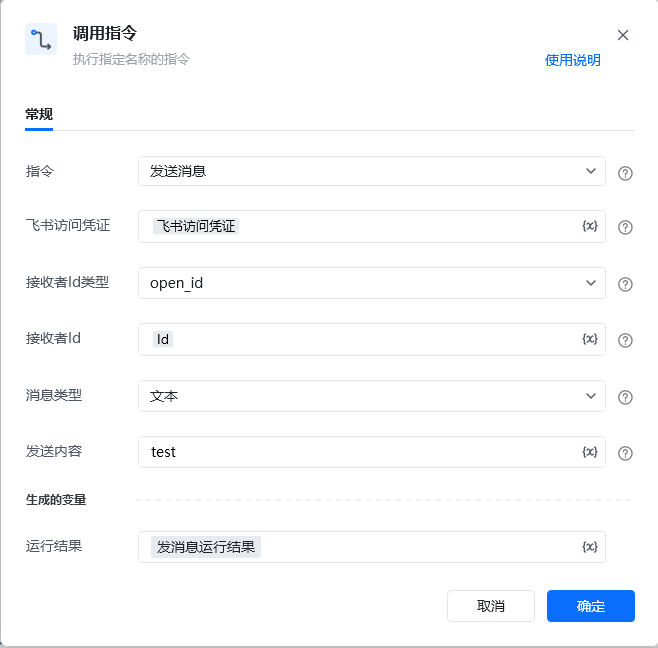
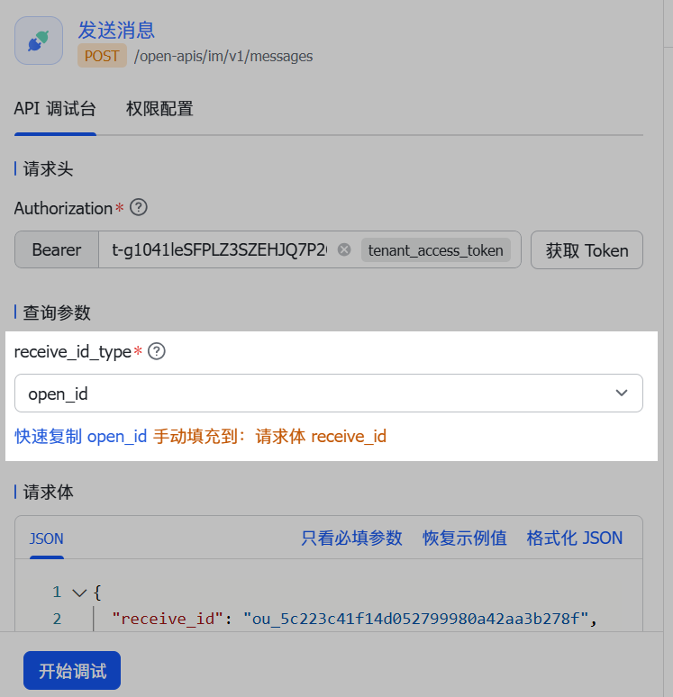
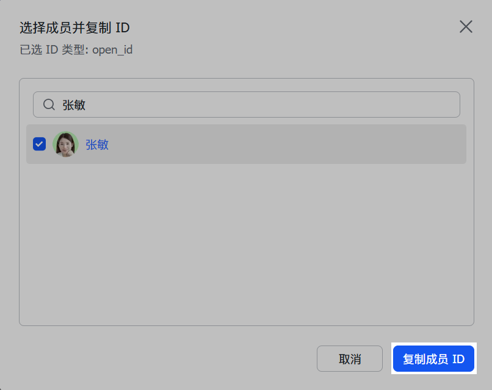

## <strong>一、指令概述</strong>

该 RPA 指令用于通过飞书开放平台 API 向指定接收者<strong>发送消息</strong>（支持文本、图片、文件三种类型），需配置飞书访问凭证、接收者标识及消息相关参数，执行后返回运行结果，适用于飞书消息的自动化触达（如告警通知、报表推送等场景）。

飞书官方开发文档参考：https://open.feishu.cn/document/server-docs/im-v1/message/create
## <strong>二、调用参数配置示意</strong>

参数名称示例 / 默认值说明指令发送消息固定选择 “发送消息”，表示执行飞书消息发送操作。飞书访问凭证飞书访问凭证使用获取飞书访问凭证指令生成接收者 Id 类型open_id / union_id / user_id / email / chat_id选择接收者标识的类型，下拉可选：- open_id：飞书内用户 / 群组的开放标识；- union_id：多租户场景下用户的唯一标识；- user_id：飞书用户 ID；- email：用户邮箱；- chat_id：飞书群组 ID。接收者 Idou_xxx / user123 / group@example.com / oc_xxx根据 “接收者 Id 类型”，输入对应的接收者标识（如open_id对应的ou_xxx字符串），支持变量。消息类型文本 / 图片 / 文件选择要发送的消息类型，下拉可选：- 文本：发送纯文本消息；- 图片：发送图片消息（需配置 “文件 / 图片 Key”）；- 文件：发送文件消息（需配置 “文件 / 图片 Key”）。文件 / 图片 KeyImageKey / FileKey根据 “消息类型” 配置：- 若为图片：输入飞书存储图片的 Key（需提前上传图片获取 Key）；- 若为文件：输入飞书存储文件的 Key（需提前上传文件获取 Key）；- 若为文本：无需配置该字段。支持变量。生成的变量 - 运行结果发消息运行结果存储消息发送的结果（如成功状态、消息 ID 等），需配置为自定义变量，后续流程可调用，支持变量。
## <strong>三、使用示例（发送图片消息场景）</strong>
### <strong>场景：通过飞书向指定用户（以open_id为ou_123abc标识）发送产品截图（图片 Key 为img_456def）。</strong>
#### <strong>参数配置：</strong>

• 指令：发送消息

• 飞书访问凭证：feishuAuthToken（提前配置的飞书访问凭证变量）

• 接收者 Id 类型：open_id

• 接收者 Id：ou_123abc

• 消息类型：图片

• 文件 / 图片 Key：img_456def

• 运行结果：msgSendResult（自定义变量，存储发送结果）
#### <strong>执行流程：</strong>

调用该 RPA 指令后，RPA 会通过飞书访问凭证认证，向open_id为ou_123abc的接收者发送图片（Key 为img_456def），并将发送结果（如成功时返回消息 ID，失败时返回错误原因）存入msgSendResult变量。
## <strong>四、返回结果说明</strong>

指令执行后，“运行结果” 变量会存储飞书 API 返回的 JSON 结果（示例为成功发送图片的响应，关键参数可参考官方文档）：

\{ "code": 0, "msg": "success", "data": \{ "message_id": "om_dc13264520392913993dd051dba21dcf", "root_id": "om_40eb06e7b84dc71c03e009ad3c754195", "parent_id": "om_d4be107c616aed9c1da8ed8068570a9f", "thread_id": "omt_d4be107c616a", "msg_type": "interactive", "create_time": "1615380573411", "update_time": "1615380573411", "deleted": false, "updated": false, "chat_id": "oc_5ad11d72b830411d72b836c20", "sender": \{ "id": "cli_9f427eec54ae901b", "id_type": "app_id", "sender_type": "app", "tenant_key": "736588c9260f175e" \}, "body": \{ "content": "\{\"text\":\"@_user_1 test content\"\}" \}, "mentions": [ \{ "key": "@_user_1", "id": "ou_155184d1e73cbfb8973e5a9e698e74f2", "id_type": "open_id", "name": "Tom", "tenant_key": "736588c9260f175e" \} ], "upper_message_id": "om_40eb06e7b84dc71c03e009ad3c754195" \}\}

• code：状态码，0表示成功，非0为失败（具体错误码含义见官方文档）。

• msg：提示信息，success表示发送成功。
## <strong>五、注意事项</strong>

1. <strong>访问凭证有效性</strong>：“飞书访问凭证” 需具备<strong>消息发送权限</strong>且未过期，否则会因权限不足导致发送失败。

2. <strong>接收者 Id 类型与标识匹配</strong>：“接收者 Id 类型” 需与 “接收者 Id” 严格对应（如选email则 “接收者 Id” 需填有效邮箱），否则无法定位接收者。

3. <strong>消息类型与 Key 的对应</strong>：

◦ 若 “消息类型” 为图片/文件，需确保 “文件 / 图片 Key” 是飞书已存储资源的有效 Key（可通过飞书 “上传文件 / 图片” 类指令提前获取）；

◦ 若 “消息类型” 为文本，无需配置 “文件 / 图片 Key”，否则可能报错。

1. <strong>变量配置规范性</strong>：“飞书访问凭证”“接收者 Id”“文件 / 图片 Key”“运行结果” 需配置为合法变量（如提前定义变量名、确保数据类型匹配），否则无法正确传递 / 存储数据。
## <strong>六、延伸应用</strong>

可结合 RPA 的「定时触发」「数据读取」指令，实现<strong>定时推送个性化消息</strong>（如每日向团队发送报表截图）；或结合「条件判断」指令，根据业务结果（如订单异常）触发<strong>告警消息发送</strong>，实现飞书消息与业务流程的自动化联动。
获取用户的open_id / union_id / user_id 的方法如下：登录 API 调试台，找到发送消息接口。在 查询参数 页签，将 user_id_type 设置为 open_id，然后点击 快速复制 open_id。

在弹窗中，搜索或选择指定用户，并点击 <strong>复制成员 ID</strong>，获取用户的 open_id。

## 方式二：调用 OpenAPI 获取

调用通过手机号或邮箱获取用户 ID[通过手机号或邮箱获取用户 ID](https://open.feishu.cn/document/uAjLw4CM/ukTMukTMukTM/reference/contact-v3/user/batch_get_id)接口，通过用户的邮箱或者手机号码获取用户的 open_id。调用方式如下：应用需要申请 通过手机号或邮箱获取用户 ID 权限（contact:user.id:readonly） 权限。请求时，查询参数 user_id_type 需要设置为 open_id，请求参数传入指定用户的邮箱地址（emails）或者手机号码（mobiles）。其他参数参考 API 文档详细说明填写即可，此处不再赘述。发送请求，在返回结果中获取用户的 open_id。该接口返回参数 user_id 的值与查询参数 user_id_type 的取值相匹配。例如，user_id_type 取值为 open_id，则返回参数 user_id 实际值是以 ou_ 字符为前缀的 open_id。

<Info>
  使用指令过程中遇到问题？前往 [八爪鱼RPA 开发者社区问答板块](https://rpa.bazhuayu.com/community/questions) 提问，获取官方与社区帮助。
</Info>
