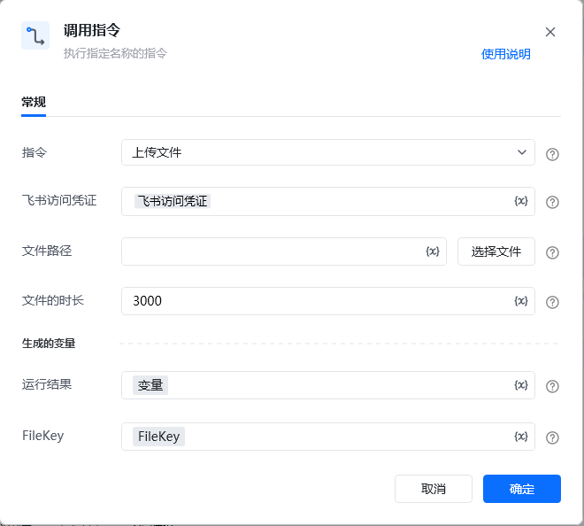

## <strong>一、指令概述</strong>

该 RPA 指令用于将本地文件上传至飞书开放平台，上传成功后返回文件在飞书的唯一标识 FileKey 及运行结果，FileKey 可用于后续 “发送消息” 等指令中引用该文件（如发送文件消息）。文件大小限制为不超过 30 MB，且不允许上传空文件。

飞书官方开发文档参考：https://open.feishu.cn/document/server-docs/im-v1/file/create
## <strong>二、调用参数配置示意</strong>

参数名称示例 / 默认值说明指令上传文件固定选择 “上传文件”，表示执行飞书文件上传操作。飞书访问凭证飞书访问凭证配置飞书开放平台的访问凭证（需具备文件上传权限，可通过 “获取飞书访问凭证” 指令生成），支持变量（界面显示 “\{x\}” 标识）。文件路径（如 “C:\Documents\report.pdf”）输入要上传的本地文件路径；可点击「选择文件」按钮选取本地文件，支持变量。文件的时长3000（可选）上传音视频文件时必填，单位为毫秒，用于标识音视频时长；非音视频文件可不填，支持变量。生成的变量 - 运行结果变量（自定义变量名）存储文件上传的执行结果（对应飞书 API 返回的完整响应），需配置为自定义变量，后续流程可调用，支持变量。生成的变量 - FileKeyFileKey（自定义变量名）存储上传后文件在飞书的唯一标识（对应飞书 API 返回的 file_key 字段），用于后续发送文件消息等场景引用该文件，需配置为自定义变量，支持变量。
## <strong>三、使用示例（上传报表 PDF 场景）</strong>
### <strong>场景：将本地路径为 “C:\Documents\2025Q3_report.pdf” 的报表文件上传至飞书，获取 FileKey 用于后续发送文件消息。</strong>
#### <strong>参数配置：</strong>

• 指令：上传文件

• 飞书访问凭证：feishuAuthToken（通过 “获取飞书访问凭证” 指令生成的变量）

• 文件路径：C:\Documents\2025Q3_report.pdf（或通过「选择文件」选取）

• 文件的时长：（因是 PDF 非音视频，可不填）

• 运行结果：uploadFileResult（自定义变量，存储上传结果的完整 API 响应）

• FileKey：reportFileKey（自定义变量，存储文件唯一标识 file_key）
#### <strong>执行流程：</strong>

调用该 RPA 指令后，RPA 会通过 feishuAuthToken 完成飞书 API 认证，读取本地路径的报表文件并上传至飞书；上传完成后，将飞书 API 返回的完整响应存入 uploadFileResult，并提取响应中的 file_key 赋值给 reportFileKey。后续可在 “发送消息” 指令中，引用 reportFileKey 作为 “文件 / 图片 Key” 发送该文件。
## <strong>四、返回结果说明</strong>
### <strong>1. 飞书 API 标准响应示例（成功场景）：</strong>

指令执行后，“运行结果” 变量（如 uploadFileResult）会存储飞书 API 返回的完整 JSON 响应，格式如下：

\{ "code": 0, "msg": "success", "data": \{ "file_key": "file_456a92d6-c6ea-4de4-ac3f-7afcf44ac78g" \}\}
### <strong>2. 响应字段含义：</strong>

• code：状态码，0 表示上传成功，非 0 为失败（具体错误码含义可参考飞书官方开发文档）。

• msg：提示信息，success 表示上传成功，失败时会返回具体错误描述（如 “文件大小超过限制”“空文件不允许上传”）。

• data：核心返回数据，包含 file_key 字段 —— 即文件在飞书的唯一标识，RPA 会自动提取该字段值存入 “生成的变量 - FileKey”（如 reportFileKey）。
### <strong>3. FileKey 结果：</strong>

“生成的变量 - FileKey”（如 reportFileKey）会被直接赋值为响应中的 file_key 字符串（如 file_456a92d6-c6ea-4de4-ac3f-7afcf44ac78g），后续可通过该标识在飞书内定位并使用该文件。
## <strong>五、注意事项</strong>

1. <strong>访问凭证有效性</strong>：“飞书访问凭证” 需具备<strong>文件上传权限</strong>且未过期（建议通过 “获取飞书访问凭证” 指令动态生成有效凭证），否则会因权限不足或凭证失效导致上传失败（对应 API 响应 code≠0，msg 会提示具体原因）。

2. <strong>文件合法性限制</strong>：

◦ 文件大小需 ≤ 30 MB，否则会触发 “文件大小超过限制” 错误；

◦ 不允许上传空文件，否则会触发 “空文件不允许上传” 错误；

◦ 路径需指向本地<strong>真实存在的文件</strong>，否则会因 “文件不存在” 报错。

1. <strong>音视频时长必填性</strong>：若上传<strong>音视频文件</strong>，“文件的时长” 参数为必填项，需准确填写音视频的时长（单位：毫秒），否则会触发 “音视频文件时长缺失” 错误；非音视频文件（如 PDF、文档等）可不填该参数。

2. <strong>变量与 API 响应关联</strong>：“生成的变量 - FileKey” 是从 API 响应的 data.file_key 字段提取的，需确保变量配置正确，避免因字段匹配错误导致无法获取标识。

3. <strong>后续场景联动</strong>：上传成功后，FileKey（即 file_key）可直接用于 “发送消息” 指令的 “文件 / 图片 Key” 参数，实现 “上传文件 → 发送文件消息” 的自动化闭环，无需额外转换格式。
## <strong>六、延伸应用</strong>

可结合 RPA 的 “发送消息” 指令与 “定时触发” 指令，实现<strong>定时上传 + 发送文件</strong>的自动化流程：例如每周一自动读取本地生成的周度业务报告（如 “C:\WeeklyReports\2025W40_report.pdf”），调用本指令上传至飞书并获取 FileKey，再通过 “发送消息” 指令将文件发送至指定飞书群组（如 “部门周会群”），同时附带文本说明（如 “2025 年第 40 周业务报告”），替代人工手动上传和发送操作，提升协作效率。

<Info>
  使用指令过程中遇到问题？前往 [八爪鱼RPA 开发者社区问答板块](https://rpa.bazhuayu.com/community/questions) 提问，获取官方与社区帮助。
</Info>
