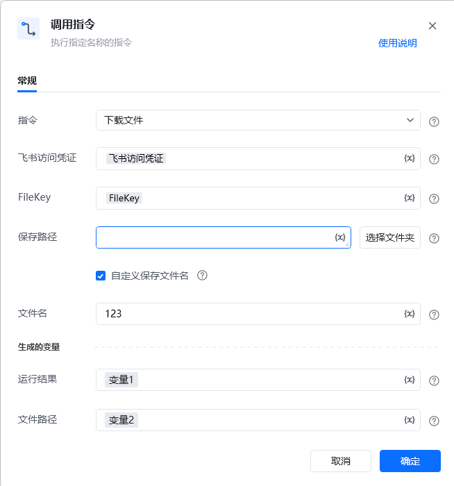

# <strong>一、指令概述</strong>

该 RPA 指令用于从飞书下载指定 FileKey 对应的文件到本地指定路径，需配置飞书访问凭证、文件唯一标识（FileKey）及本地保存参数，执行后返回运行结果与最终文件路径，适用于飞书文件的本地化备份、离线使用等场景。

飞书官方开发文档参考：https://open.feishu.cn/document/server-docs/im-v1/file/get
## <strong>二、调用参数配置示意</strong>

参数名称示例 / 默认值说明指令下载文件固定选择 “下载文件”，表示执行飞书文件下载操作。飞书访问凭证飞书访问凭证配置飞书开放平台的访问凭证（需具备文件下载权限，可通过 “获取飞书访问凭证” 指令生成），支持变量（界面显示 “\{x\}” 标识）。FileKeyfile_****************输入要下载文件在飞书的唯一标识（需提前通过 “上传文件” 等指令获取），支持变量（关键字符已打码）。保存路径（如 “C:\Downloads\”）输入本地保存文件的文件夹路径；可点击「选择文件夹」按钮选取路径，支持变量。自定义保存文件名（勾选状态）勾选后可自定义下载后的文件名称，未勾选则使用飞书默认命名规则。文件名test当 “自定义保存文件名” 勾选时，输入下载后文件的名称（无需带后缀，会自动匹配文件格式），支持变量。生成的变量 - 运行结果变量1（自定义变量名）存储文件下载的执行结果（如成功状态、错误信息等），需配置为自定义变量，后续流程可调用，支持变量。生成的变量 - 文件路径变量2（自定义变量名）存储下载后文件在本地的完整文件路径（如 “C:\Downloads\test.mp3”），需配置为自定义变量，支持变量。
## <strong>三、使用示例（下载飞书文件并自定义命名场景）</strong>
### <strong>场景：从飞书下载 FileKey 为 file_**************** 的文件，保存到 “C:\Documents\” 路径下，自定义文件名为 “meeting_notes”。</strong>
#### <strong>参数配置：</strong>

• 指令：下载文件

• 飞书访问凭证：feishuAuthToken（通过 “获取飞书访问凭证” 指令生成的变量）

• FileKey：file_****************（提前通过 “上传文件” 指令获取的文件标识变量，关键字符已打码）

• 保存路径：C:\Documents\（或通过「选择文件夹」选取）

• 自定义保存文件名：勾选

• 文件名：meeting_notes

• 运行结果：downloadResult（自定义变量，存储下载结果）

• 文件路径：localFilePath（自定义变量，存储本地完整路径）
#### <strong>执行流程：</strong>

调用该 RPA 指令后，RPA 会通过 feishuAuthToken 完成飞书 API 认证，根据 FileKey 定位飞书文件并下载；下载完成后，将执行结果存入 downloadResult，并把本地完整文件路径（如 “C:\Documents\meeting_notes.mp3”）存入 localFilePath，便于后续流程（如本地文件查看、分享至其他系统）调用。
## <strong>四、返回结果说明</strong>
### <strong>1. 飞书 API 标准返回示例（成功场景，关键信息已打码）：</strong>

指令执行后，“运行结果” 变量（如downloadResult）会存储包含下载状态、本地路径等信息的 JSON 结果，格式如下：

\{ "success": true, "file_path": "C:\\Users\\****\\Desktop\\test\\新建文件夹\\MP3.mp3", "content_type": "application/octet-stream", "http_status": 200\}
### <strong>2. 响应字段含义：</strong>

• success：布尔值，true 表示文件下载成功，false 表示下载失败（失败时会补充 error_msg 字段说明原因，如 “FileKey 不存在”“本地路径无写入权限”）。

• file_path：本地完整文件路径（用户信息 “niuyanfei” 已替换为 “****” 打码处理），与 “生成的变量 - 文件路径”（如localFilePath）值一致，可直接用于访问本地文件。

• content_type：文件的 MIME 类型，如 “application/octet-stream”（二进制流）、“text/plain”（纯文本）等，反映文件格式。

• http_status：HTTP 响应状态码，200 表示飞书 API 请求成功（非 200 需结合飞书官方文档排查，如401表示凭证失效、404表示文件不存在）。
### <strong>3. 文件路径结果：</strong>

“生成的变量 - 文件路径”（如localFilePath）会被直接赋值为上述 file_path 字段的打码后路径（如 “C:\Users****\Desktop\test\ 新建文件夹 \MP3.mp3”），后续可通过该路径调用本地文件进行处理。
## <strong>五、注意事项</strong>

1. <strong>访问凭证有效性</strong>：“飞书访问凭证” 需具备<strong>文件下载权限</strong>且未过期（建议通过 “获取飞书访问凭证” 指令动态生成有效凭证），否则会导致 http_status=401 或 success=false。

2. <strong>FileKey 准确性</strong>：FileKey 需是飞书内<strong>真实存在的文件标识</strong>（需与目标文件一一对应，打码部分不影响标识有效性），否则会返回 success=false 且 error_msg="FileKey不存在"，http_status=404。

3. <strong>保存路径合法性</strong>：“保存路径” 需指向本地<strong>存在且可写入的文件夹</strong>（避免系统保护路径，如 “C:\Windows\”），否则会因 “路径不存在” 或 “无写入权限” 导致 success=false。

4. <strong>文件格式兼容性</strong>：飞书支持下载的文件格式需符合其 API 规范，若遇到特殊格式无法下载，需参考飞书官方文档确认兼容性。
## <strong>六、延伸应用</strong>

可结合 RPA 的 “文件解析”“数据提取” 指令，实现<strong>飞书文件自动化下载与内容处理</strong>：例如从飞书文档库下载业务报表文件，通过本指令保存到本地后，调用文件解析指令提取关键数据，再将数据同步至企业数据库或生成可视化报表，替代人工手动下载、解析、录入的重复工作，提升数据处理效率。

<Info>
  使用指令过程中遇到问题？前往 [八爪鱼RPA 开发者社区问答板块](https://rpa.bazhuayu.com/community/questions) 提问，获取官方与社区帮助。
</Info>
