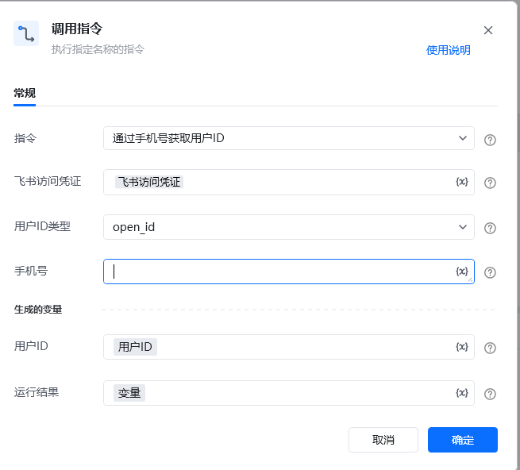

## <strong>一、指令概述</strong>

该 RPA 指令用于通过<strong>飞书手机号</strong>查询对应用户的唯一标识（支持 open_id、user_id、union_id 三种类型），为后续飞书消息发送、权限校验等场景提供用户身份标识支持。

飞书官方开发文档参考： https://open.feishu.cn/document/server-docs/contact-v3/user/batch_get_id[https://open.feishu.cn/document/server-docs/contact-v3/user/batch_get_id](https://open.feishu.cn/document/server-docs/contact-v3/user/batch_get_id)
## <strong>二、调用参数配置示意</strong>

参数名称示例 / 默认值说明指令通过手机号获取用户 ID固定选择 “通过手机号获取用户 ID”，执行飞书用户 ID 查询操作。飞书访问凭证飞书访问凭证配置飞书开放平台的访问凭证（需具备用户查询权限，可通过 “获取飞书访问凭证” 指令生成），支持变量（界面显示 “\{x\}” 标识）。用户 ID 类型open_id / user_id / union_id选择要获取的用户标识类型，下拉可选：- open_id：飞书内用户的开放标识；- user_id：飞书用户 ID；- union_id：多租户场景下用户的唯一标识。手机号***********输入要查询的飞书用户手机号（需为飞书已注册的有效手机号），全部数字已打码，支持变量。生成的变量 - 用户 ID用户ID（自定义变量名）存储查询到的用户唯一标识（如 open_id、user_id 等），需配置为自定义变量，后续流程可调用，支持变量。生成的变量 - 运行结果变量（自定义变量名）存储查询操作的执行结果（如成功状态、错误信息等），需配置为自定义变量，后续流程可调用，支持变量。
## <strong>三、使用示例（查询用户 open_id 场景）</strong>
### <strong>场景：通过手机号 *********** 查询对应用户的 open_id，用于后续发送飞书消息。</strong>
#### <strong>参数配置：</strong>

• 指令：通过手机号获取用户 ID

• 飞书访问凭证：feishuAuthToken（通过 “获取飞书访问凭证” 指令生成的变量）

• 用户 ID 类型：open_id

• 手机号：***********

• 用户 ID：targetUserOpenId（自定义变量，存储查询到的id）

• 运行结果：queryResult（自定义变量，存储查询结果）
#### <strong>执行流程：</strong>

调用该 RPA 指令后，RPA 会通过 feishuAuthToken 完成飞书 API 认证，根据全部打码的手机号 *********** 查询用户信息；查询完成后，将执行结果存入 queryResult，并把匹配到的用户 id存入 targetUserOpenId，便于后续 “发送消息” 等指令引用该用户标识。
## <strong>四、返回结果说明</strong>
### <strong>1. 飞书 API 标准返回示例（成功场景，关键信息已打码）：</strong>

指令执行后，“运行结果” 变量（如queryResult）会存储包含查询状态、用户信息的 JSON 结果，格式如下：

\{ "success": true, "data": \{ "user_list": [ \{ "mobile": "***********", "status": \{ "is_activated": true, "is_exited": false, "is_frozen": false, "is_resigned": false, "is_unjoin": false \}, "user_id": "ou_a758****************5a" \} ] \}, "request_id": "20251010093443F7D1951941060B44355E", "http_status": 200\}
### <strong>2. 响应字段含义：</strong>

• success：布尔值，true 表示查询成功，false 表示查询失败（失败时会补充 error_msg 字段说明原因，如 “手机号不存在”“权限不足”）。

• data.user_list：数组，包含匹配手机号的用户信息（若多个用户匹配手机号，会返回多条，实际场景中飞书手机号通常唯一）：

◦ mobile：查询的手机号（全部数字已打码，如***********）；

◦ status：用户状态（是否激活、是否离职等）；

◦ user_id：用户id

• request_id：飞书 API 请求唯一标识（用于问题排查）；

• http_status：HTTP 响应状态码，200 表示请求成功（非 200 需结合飞书官方文档排查，如401表示凭证失效）。
## <strong>五、注意事项</strong>

1. <strong>访问凭证有效性</strong>：“飞书访问凭证” 需具备<strong>用户查询权限</strong>且未过期（建议通过 “获取飞书访问凭证” 指令动态生成有效凭证），否则会导致 http_status=401 或 success=false。

2. <strong>手机号准确性</strong>：输入的手机号需为<strong>飞书已注册的有效手机号</strong>

3. <strong>用户 ID 类型匹配</strong>：“用户 ID 类型” 需与后续业务场景所需的标识类型一致（如 “发送消息” 指令若要求open_id，则此处需选择open_id），避免因标识类型不匹配导致后续操作失败。

4. <strong>打码信息说明</strong>：返回结果中手机号、user_id等敏感信息已打码，实际使用时会返回真实值（仅文档展示做隐私保护）。
## <strong>六、延伸应用</strong>

可结合 RPA 的 “发送消息” 指令，实现<strong>精准用户触达</strong>：例如从业务系统获取客户手机号列表，通过本指令批量查询飞书user_id，再调用 “发送消息” 指令向这些用户推送个性化通知（如订单提醒、活动通知），替代人工手动查询和发送，提升运营效率。

<Info>
  使用指令过程中遇到问题？前往 [八爪鱼RPA 开发者社区问答板块](https://rpa.bazhuayu.com/community/questions) 提问，获取官方与社区帮助。
</Info>
