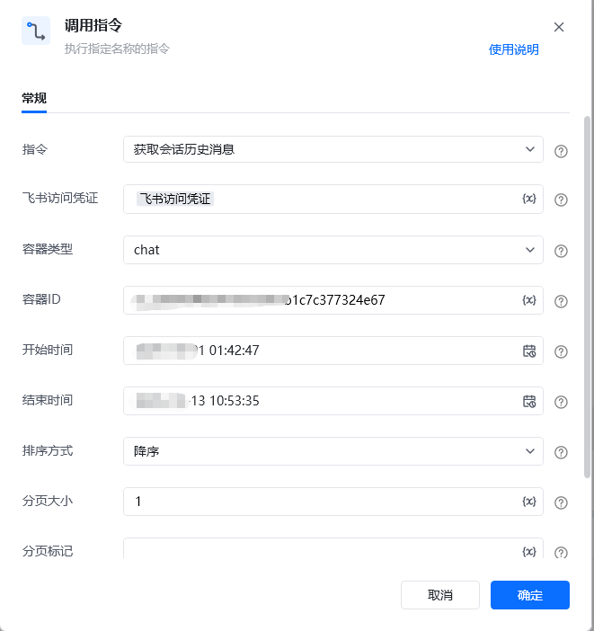
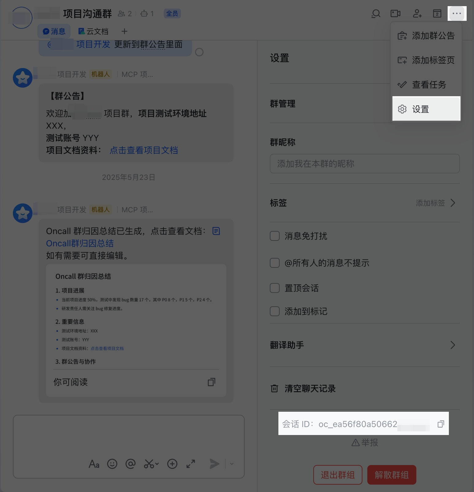
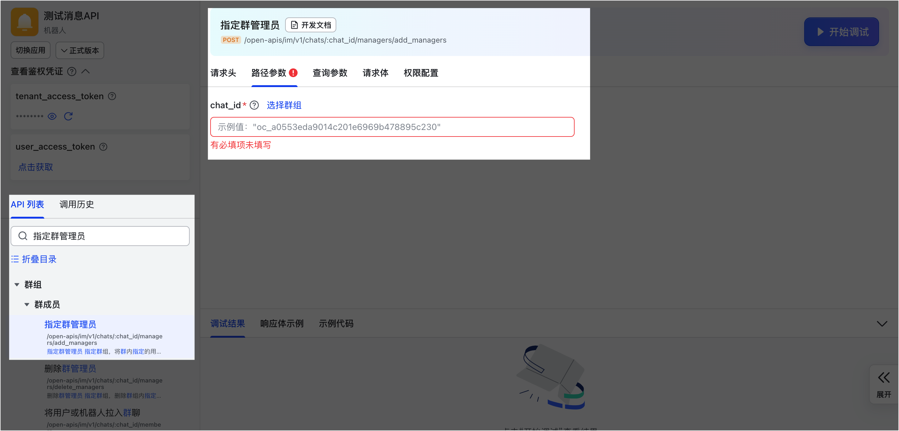
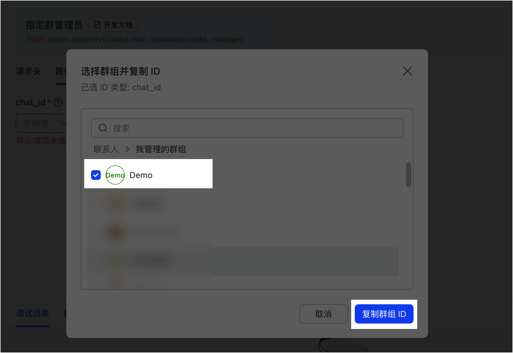
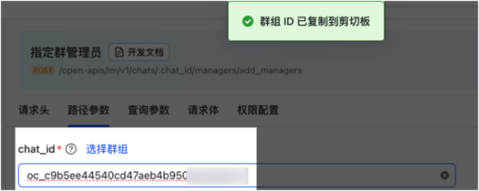
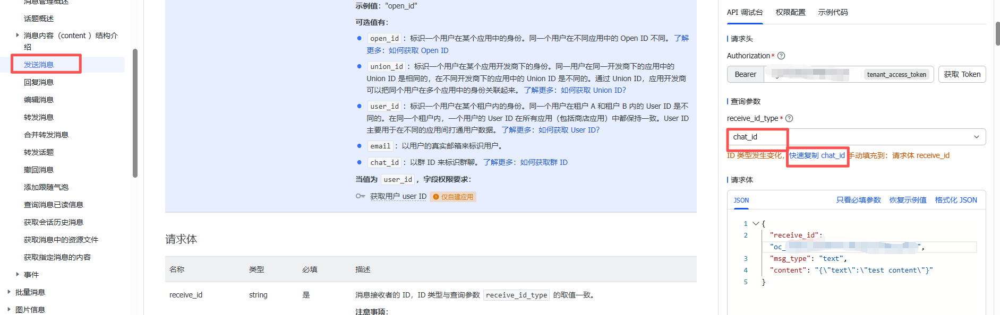
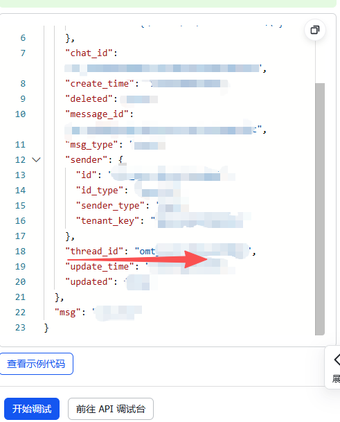

# <strong>RPA 指令文档：获取会话历史消息</strong>
## <strong>一、指令概述</strong>

该 RPA 指令用于<strong>获取飞书会话的历史消息</strong>，支持通过 “容器类型（chat/thread）”“容器 ID”“时间范围” 等条件筛选消息，返回符合条件的消息列表及分页信息，适用于飞书会话内容分析、消息存档、业务数据提取等场景。

飞书官方开发文档参考：https://open.feishu.cn/document/server-docs/im-v1/message/list?appId=cli_a8c3f0c5070ad00d
## <strong>二、调用参数配置示意</strong>

参数名称示例 / 默认值说明指令获取会话历史消息固定选择 “获取会话历史消息”，执行飞书会话消息查询操作。飞书访问凭证飞书访问凭证配置飞书开放平台的访问凭证（需具备会话消息查询权限，可通过 “获取飞书访问凭证” 指令生成），支持变量（界面显示 “\{x\}” 标识）。容器类型chat / thread选择会话容器类型，下拉可选：- chat：飞书群聊 / 单聊会话；- thread：飞书话题（子会话）。容器 IDoc_****************输入会话容器的唯一标识（如群聊 ID、话题 ID），关键字符已打码，支持变量。开始时间2025-10-01 01:42:47输入查询的时间范围起始点（需为合法时间格式），支持变量。结束时间2025-10-13 10:53:35输入查询的时间范围结束点（需为合法时间格式，且晚于开始时间），支持变量。排序方式升序 / 降序选择消息排序方式：- 升序：按消息创建时间从早到晚排序；- 降序：按消息创建时间从晚到早排序。分页大小20单次查询返回的消息数量（需为正整数，飞书有默认上限，超出需分页），支持变量。分页标记（空 /分页标记值）分页查询时，传入上一页返回的page_token可获取下一页数据，首次查询可留空，支持变量。
## <strong>三、使用示例（获取群聊历史消息场景）</strong>
### <strong>场景：获取飞书群聊（容器类型chat，容器 IDoc_****************）在2025-10-01至2025-10-13期间的历史消息，按升序排列，单次返回 20 条。</strong>
#### <strong>参数配置：</strong>

• 指令：获取会话历史消息

• 飞书访问凭证：feishuAuthToken（通过 “获取飞书访问凭证” 指令生成的变量）

• 容器类型：chat

• 容器 ID：oc_****************（群聊唯一标识，关键字符已打码）

• 开始时间：2025-10-01 01:42:47

• 结束时间：2025-10-13 10:53:35

• 排序方式：升序

• 分页大小：20

• 分页标记：（留空，首次查询）
#### <strong>执行流程：</strong>

调用该 RPA 指令后，RPA 会通过 feishuAuthToken 完成飞书 API 认证，根据容器类型、打码后的容器 ID 及时间范围，查询符合条件的群聊历史消息；查询完成后，返回消息列表（最多 20 条，按升序排列）及分页标记（若有更多数据），便于后续分页查询或消息内容处理。
## <strong>四、返回结果说明</strong>
### <strong>1. 飞书 API 标准返回示例（成功场景，关键信息已打码）：</strong>

指令执行后，返回的 JSON 结果格式如下（敏感信息已打码）：

\{ "code": 0, "msg": "success", "data": \{ "has_more": false, "page_token": "GxmvlNRvP0NdQZpa7yIqf_***********************PhXQDvtrQ==", "items": [ \{ "message_id": "om_**************************dd051dba21dcf", "root_id": "om_**************************03e009ad3c754195", "parent_id": "om_**************************da8ed8068570a9f", "thread_id": "omt_***********************6a", "msg_type": "interactive", "create_time": "1615380573411", "update_time": "1615380573411", "deleted": false, "updated": false, "chat_id": "oc_**************************836c20", "sender": \{ "id": "cli_***********************01b", "id_type": "app_id", "sender_type": "app", "tenant_key": "736588c9260f175e" \}, "body": \{ "content": "\{\"text\":\"test content\"\}" \}, "mentions": [ \{ "key": "@_user_1", "id": "ou_**************************e74f2", "id_type": "open_id", "name": "Tom", "tenant_key": "736588c9260f175e" \} ], "upper_message_id": "om_**************************ad3c754195" \} ] \}\}
### <strong>2. 响应字段含义：</strong>

• code：状态码，0 表示查询成功，非 0 为失败（具体错误码含义参考飞书官方文档）。

• msg：提示信息，success 表示查询成功。

• data：核心返回数据：

◦ has_more：布尔值，true 表示还有更多消息可分页查询，false 表示当前为最后一页。

◦ page_token：分页标记（关键字符已打码），若has_more=true，可将该值传入 “分页标记” 参数查询下一页。

◦ items：数组，包含每条历史消息的详细信息：

▪ message_id/root_id/parent_id：消息 / 根消息 / 父消息的唯一标识（关键字符已打码）；

▪ msg_type：消息类型（如interactive为互动消息，text为文本消息等）；

▪ create_time/update_time：消息创建 / 更新的时间戳；

▪ chat_id：会话容器 ID（关键字符已打码）；

▪ sender：消息发送者信息（id等关键字段已打码）；

▪ body：消息内容体（如文本消息的content字段）；

▪ mentions：消息中 @的用户列表（id等关键字段已打码）。
## <strong>五、注意事项</strong>

1. <strong>访问凭证有效性</strong>：“飞书访问凭证” 需具备<strong>会话消息查询权限</strong>且未过期（建议通过 “获取飞书访问凭证” 指令动态生成有效凭证），否则会导致 code≠0 或查询失败。

2. <strong>容器类型与 ID 匹配</strong>：“容器类型” 需与 “容器 ID” 严格对应（如选chat则容器ID需为群聊 / 单聊 ID，选thread则为话题 ID），否则会返回空结果或错误。

3. <strong>时间范围合理性</strong>：“开始时间” 需早于 “结束时间”，且时间格式需符合飞书 API 要求（否则会触发格式错误）；若时间范围过大，建议结合 “分页大小” 分批查询，避免单次请求数据量过大。

4. <strong>打码信息说明</strong>：返回结果中message_id、chat_id、sender.id等敏感信息已打码，实际使用时会返回真实值（仅文档展示做隐私保护）。
## <strong>六、延伸应用</strong>

可结合 RPA 的 “数据解析”“条件判断” 指令，实现<strong>会话消息自动化监控与处理</strong>：例如定期获取指定群聊的历史消息，解析消息内容中的关键词（如 “故障”“需求”），当匹配到关键信息时，自动触发告警流程或生成任务工单，替代人工手动查看会话的重复工作，提升团队协作效率。
#### 容器ID获取方式分俩种:当容器id选择为：chat时获取方式如下：

群成员可以通过点击右上角的群菜单选项进入群设置页面，查看群 ID

登录 API 调试台。选择一个需要使用群 ID 的接口，例如指定群管理员。

点击获取页签，点击选择群组。

在弹出的对话框中选择群组，并点击 复制群组 ID。

成功复制后，即可将群组 ID 粘贴到对应参数值中使用，如下图所示。

第二种容器类型选择thread：方式一：在话题形式群中，调用发送消息、回复消息、转发消息等接口，从响应的结果中获取 thread_id 参数值。方式二：在消息形式群中，调用回复消息接口，传入 "reply_in_thread": "true" 参数值（即以话题形式进行回复）， 从响应的结果中获取 thread_id 参数值。方式三：监听接收消息事件，若消息为话题消息，可从事件体中获得话题消息的 thread_id。方式四：调用获取指定消息的内容、获取会话历史消息接口，若消息为话题消息，可从响应体中获取 thread_id 参数值。

如调用发送消息控制台：

第一步：获取Token

第二步：选择为chat_id点击快速复制chat_id然后填写到请求体里面的receive_id里面然后点击调试就可以获取到容器id

<Info>
  使用指令过程中遇到问题？前往 [八爪鱼RPA 开发者社区问答板块](https://rpa.bazhuayu.com/community/questions) 提问，获取官方与社区帮助。
</Info>
