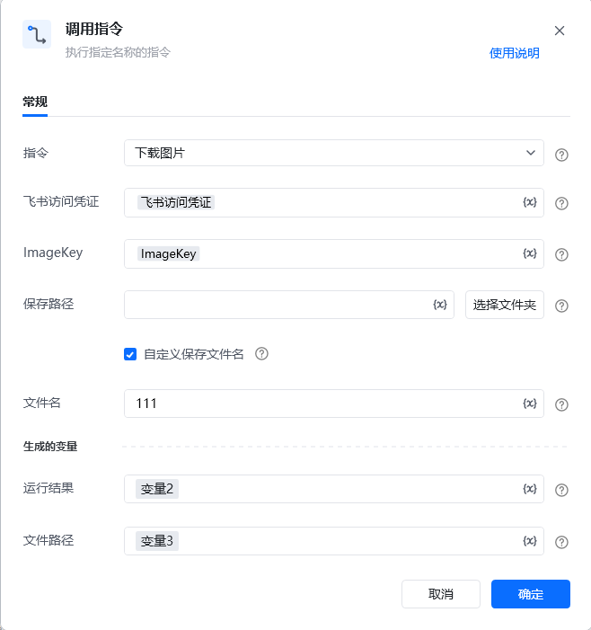

## <strong>一、指令概述</strong>

该 RPA 指令用于从飞书下载指定 ImageKey 对应的图片到本地指定路径，需配置飞书访问凭证、图片唯一标识（ImageKey）及本地保存参数，执行后返回运行结果与最终文件路径，适用于飞书图片的本地化备份、二次编辑等场景。

飞书官方开发文档参考：https://open.feishu.cn/document/server-docs/im-v1/image/get
## <strong>二、调用参数配置示意</strong>

参数名称示例 / 默认值说明指令下载图片固定选择 “下载图片”，表示执行飞书图片下载操作。飞书访问凭证飞书访问凭证配置飞书开放平台的访问凭证（需具备图片下载权限，可通过 “获取飞书访问凭证” 指令生成），支持变量（界面显示 “\{x\}” 标识）。ImageKeyimg_v2_xxx输入要下载图片在飞书的唯一标识（需提前通过 “上传图片” 等指令获取），支持变量。保存路径（如 “C:\Downloads\”）输入本地保存图片的文件夹路径；可点击「选择文件夹」按钮选取路径，支持变量。自定义保存文件名（勾选状态）勾选后可自定义下载后的图片文件名，未勾选则使用飞书默认命名规则。文件名test当 “自定义保存文件名” 勾选时，输入下载后图片的文件名（无需带后缀，会自动匹配图片格式），支持变量。生成的变量 - 运行结果变量2（自定义变量名）存储图片下载的执行结果（如成功状态、错误信息等），需配置为自定义变量，后续流程可调用，支持变量。生成的变量 - 文件路径变量3（自定义变量名）存储下载后图片在本地的完整文件路径（如 “C:\Downloads\test.png”），需配置为自定义变量，支持变量。
## <strong>三、使用示例（下载飞书图片并自定义命名场景）</strong>
### <strong>场景：从飞书下载 ImageKey 为 img_v2_abc123 的图片，保存到 “C:\Reports\” 路径下，自定义文件名为 “sales_report”。</strong>
#### <strong>参数配置：</strong>

• 指令：下载图片

• 飞书访问凭证：feishuAuthToken（通过 “获取飞书访问凭证” 指令生成的变量）

• ImageKey：img_v2_abc123（提前通过 “上传图片” 指令获取的图片标识变量）

• 保存路径：C:\Reports\（或通过「选择文件夹」选取）

• 自定义保存文件名：勾选

• 文件名：sales_report

• 运行结果：downloadResult（自定义变量，存储下载结果）

• 文件路径：localImgPath（自定义变量，存储本地完整路径）
#### <strong>执行流程：</strong>

调用该 RPA 指令后，RPA 会通过 feishuAuthToken 完成飞书 API 认证，根据 ImageKey 定位飞书图片并下载；下载完成后，将执行结果存入 downloadResult，并把本地完整文件路径（如 “C:\Reports\sales_report.png”）存入 localImgPath，便于后续流程（如本地图片处理、上传至其他系统）调用。
## <strong>四、返回结果说明</strong>
### <strong>1. 运行结果（RPA 执行层标准返回示例，关键信息已掩码）：</strong>

指令执行后，“运行结果” 变量（如downloadResult）会存储包含下载状态、本地路径等信息的 JSON 结果，格式如下：

\{ "success": true, "file_path": "C:\\Users\\****\\Desktop\\test\\新建文件夹\\feishu_image_img_v3_**************************.jpg", "content_type": "image/jpeg", "http_status": 200\}
### <strong>2. 响应字段含义：</strong>

• success：布尔值，true 表示图片下载成功，false 表示下载失败（失败时会补充 error_msg 字段说明原因，如 “ImageKey 不存在”“本地路径无写入权限”）。

• file_path：本地完整文件路径（敏感信息已掩码，如用户名 “****”、图片唯一标识 “**************************”），与 “生成的变量 - 文件路径”（如localImgPath）值一致，可直接用于访问本地图片。

• content_type：图片文件类型，如 “image/jpeg”“image/png”，对应图片实际格式。

• http_status：HTTP 响应状态码，200 表示飞书 API 请求成功（非 200 需结合飞书官方文档排查，如401表示凭证失效、404表示图片不存在）。
### <strong>3. 文件路径结果：</strong>

“生成的变量 - 文件路径”（如localImgPath）会被直接赋值为上述 file_path 字段的掩码后路径（如 “C:\Users\****\Desktop\test\ 新建文件夹 \feishu_image_img_v3_**************************.jpg”），后续可通过该路径调用本地图片进行处理。
## <strong>五、注意事项</strong>

1. <strong>访问凭证有效性</strong>：“飞书访问凭证” 需具备<strong>图片下载权限</strong>且未过期（建议通过 “获取飞书访问凭证” 指令动态生成有效凭证），否则会导致 http_status=401 或 success=false。

2. <strong>ImageKey 准确性</strong>：ImageKey 需是飞书内<strong>真实存在的图片标识</strong>（需与目标图片一一对应），否则会返回 success=false 且 error_msg="ImageKey不存在"，http_status=404。

3. <strong>保存路径合法性</strong>：“保存路径” 需指向本地<strong>存在且可写入的文件夹</strong>（避免系统保护路径，如 “C:\Windows\”），否则会因 “路径不存在” 或 “无写入权限” 导致 success=false。

4. <strong>掩码信息说明</strong>：返回结果中 file_path 的用户名、图片标识等敏感信息已掩码，实际使用时会替换为真实路径（仅对当前 RPA 流程可见，确保信息安全）。
## <strong>六、延伸应用</strong>

可结合 RPA 的 “图片处理”“OCR 识别” 指令，实现<strong>飞书图片自动化下载与内容提取</strong>：例如从飞书客户群下载包含订单信息的图片，通过本指令下载到本地后，调用 OCR 指令提取订单号、金额等关键数据，再将数据写入飞书多维表格或本地 Excel，替代人工手动下载、识别、录入的重复工作，提升数据处理效率。

<Info>
  使用指令过程中遇到问题？前往 [八爪鱼RPA 开发者社区问答板块](https://rpa.bazhuayu.com/community/questions) 提问，获取官方与社区帮助。
</Info>
