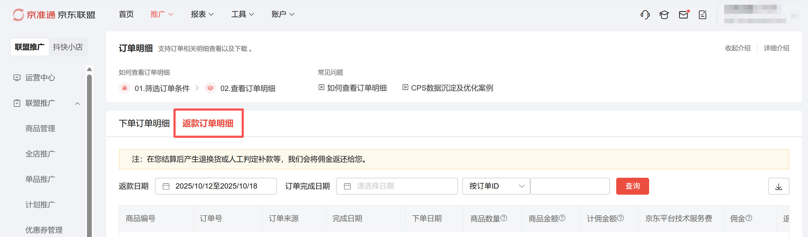
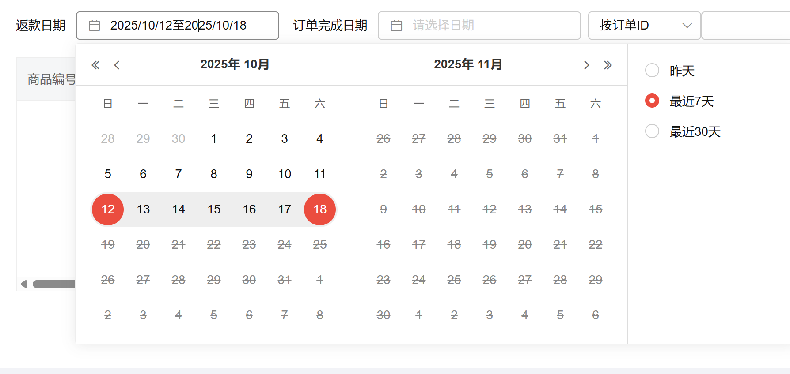
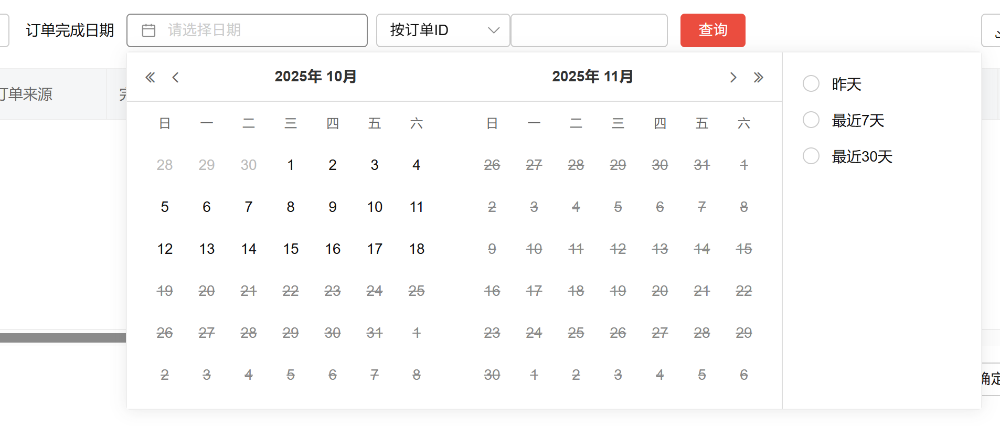
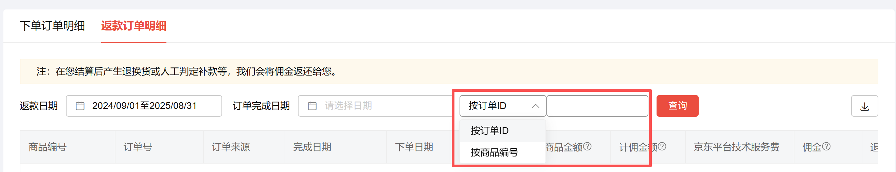
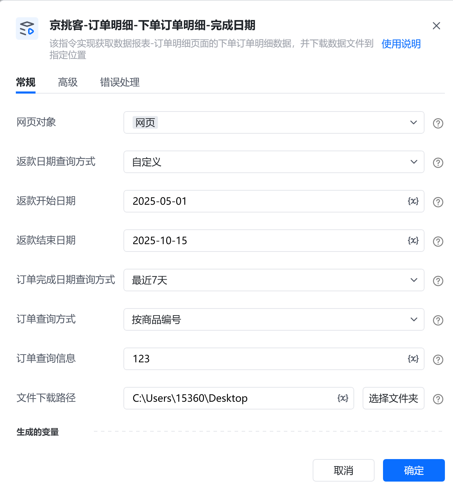
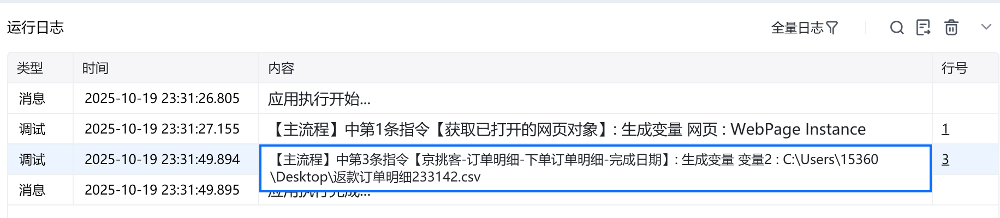

# 描述

该指令实现获取数据报表-订单明细页面的下单订单明细数据，并下载数据文件到指定位置

# 配置项说明
## 指令输入
#### 网页对象：

任意一个已登录京准通后台的网页对象
#### 返款日期查询方式：

下拉框，选择返款日期查询方式

#### 返款开始日期：

填写返款开始日期，格式：YYYY-MM-DD，例如：2025-01-01，仅当时间查询方式为自定义时填写。由于平台限制，开始日期和结束日期跨度不可超过一年
#### 返款结束日期：

填写返款结束日期，格式：YYYY-MM-DD，例如：2025-01-01，仅当时间查询方式为自定义时填写。由于平台限制，开始日期和结束日期跨度不可超过一年
#### 订单完成日期查询方式：

下拉框，选择下单日期查询方式

#### 订单完成开始日期：

填写订单完成开始日期，格式：YYYY-MM-DD，例如：2025-01-01，仅当时间查询方式为自定义时填写。由于平台限制，开始日期和结束日期跨度不可超过一年
#### 订单完成结束日期：

填写订单完成结束日期，格式：YYYY-MM-DD，例如：2025-01-01，仅当时间查询方式为自定义时填写。由于平台限制，开始日期和结束日期跨度不可超过一年
#### 订单查询方式：

下拉框，选择订单查询方式。选填，若不填则默认按ID查询

#### 订单查询信息：

填写订单查询信息。选填，若不填则默认全部

#### 文件下载路径：

下载的文件保存的文件夹路径，支持本地文件夹预览和变量传参，必填项
#### 自定义文件名：

下载或生成文件保存的名称，选填，若不填则使用平台默认值
## 指令输出
#### 文件路径：

返回文本类型，完整的文件下载路径
# 使用示例

# 运行结果

<Info>
  使用指令过程中遇到问题？前往 [八爪鱼RPA 开发者社区问答板块](https://rpa.bazhuayu.com/community/questions) 提问，获取官方与社区帮助。
</Info>
