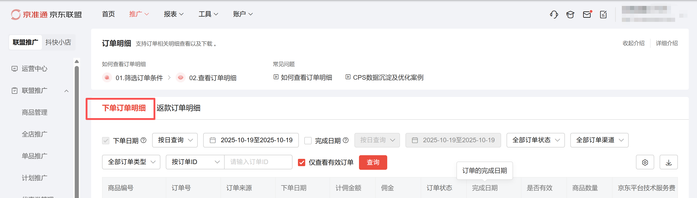
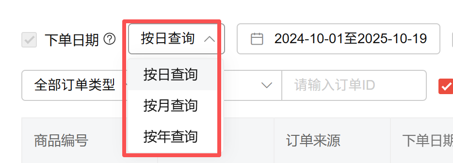
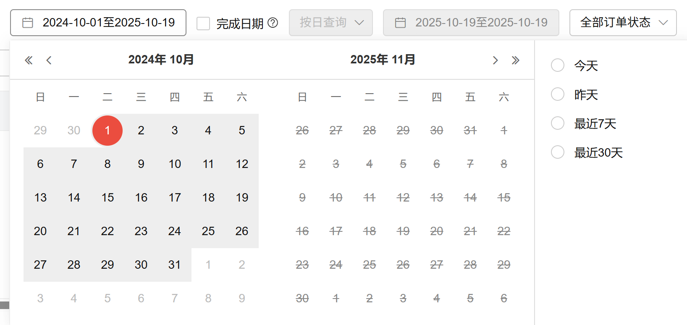
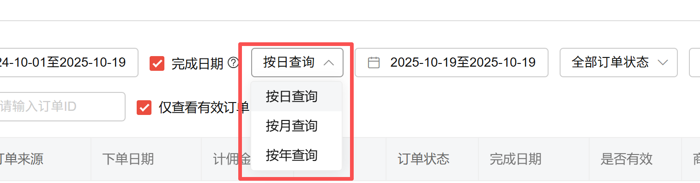
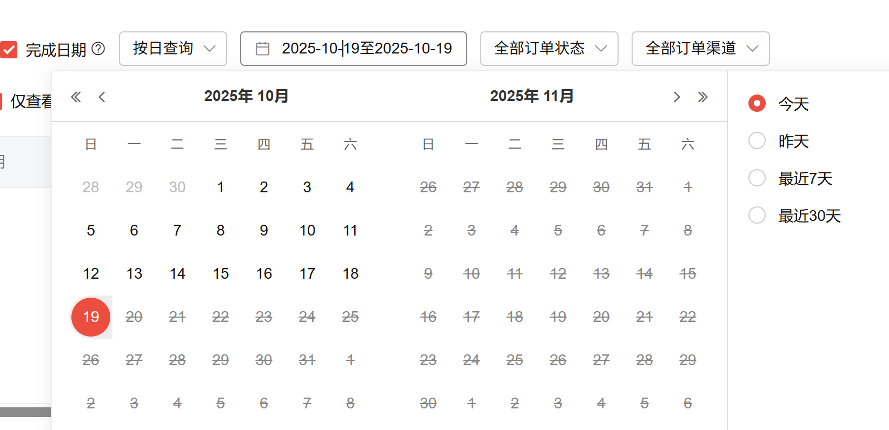
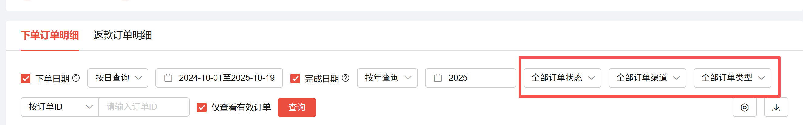
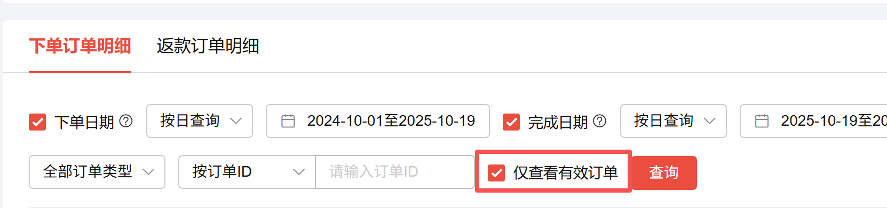
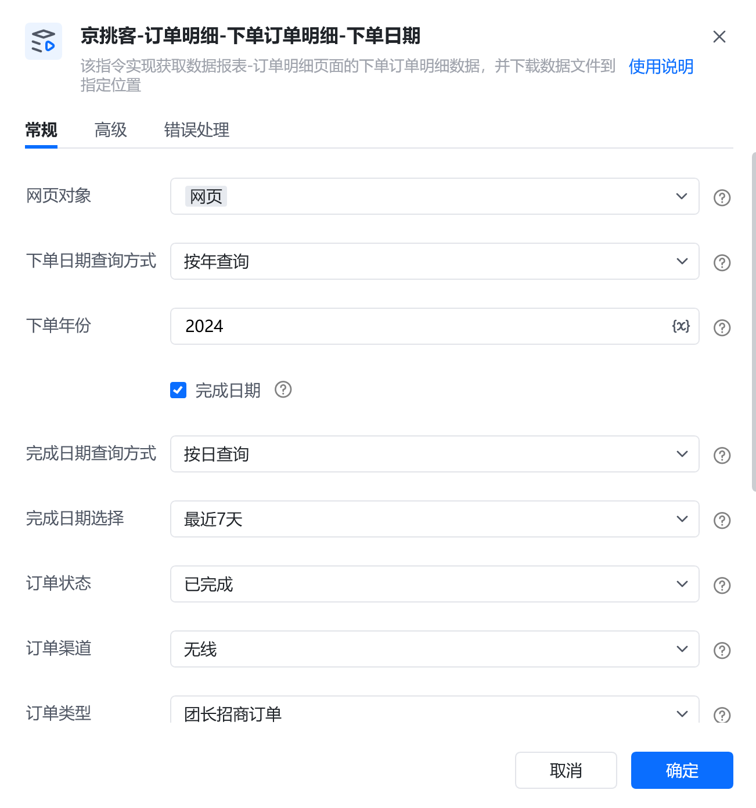
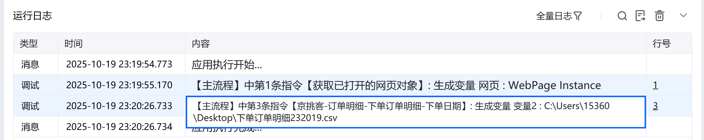

# 描述

该指令实现获取数据报表-订单明细页面的下单订单明细数据，并下载数据文件到指定位置

# 配置项说明
## 指令输入
#### 网页对象：

任意一个已登录京准通后台的网页对象
#### 下单日期查询方式：

下拉框，选择下单日期查询方式

#### 下单日期选择：

下拉框，选择下单日期

#### 下单开始日：

填写下单开始日，格式：YYYY-MM-DD，例如：2025-01-01，仅当时间查询方式为自定义时填写。由于平台限制，开始日期和结束日期跨度不可超过一年
#### 下单结束日：

填写下单结束日，格式：YYYY-MM-DD，例如：2025-01-01，仅当时间查询方式为自定义时填写。由于平台限制，开始日期和结束日期跨度不可超过一年
#### 下单开始月：

填写下单开始月，格式：YYYY-MM，例如：2025-01，仅当时间查询方式为自定义时填写。由于平台限制，开始日期和结束日期跨度不可超过一年
#### 下单结束月：

填写下单结束月，格式：YYYY-MM，例如：2025-01，仅当时间查询方式为自定义时填写。由于平台限制，开始日期和结束日期跨度不可超过一年
#### 下单年份：

填写下单年份，格式：YYYY，例如：2025，仅当时间查询方式为自定义时填写
#### 完成日期：

复选框，若选中完成日期，则代表您要限制完成时间
#### 完成日期查询方式：

下拉框，选择下单日期查询方式

#### 完成日期选择：

下拉框，选择下单日期

#### 完成开始日：

填写完成开始日，格式：YYYY-MM-DD，例如：2025-01-01，仅当时间查询方式为自定义时填写。由于平台限制，开始日期和结束日期跨度不可超过一年
#### 完成结束日：

填写完成结束日，格式：YYYY-MM-DD，例如：2025-01-01，仅当时间查询方式为自定义时填写。由于平台限制，开始日期和结束日期跨度不可超过一年
#### 完成开始月：

填写完成开始月，格式：YYYY-MM，例如：2025-01，仅当时间查询方式为自定义时填写。由于平台限制，开始日期和结束日期跨度不可超过一年
#### 完成结束月：

填写完成结束月，格式：YYYY-MM，例如：2025-01，仅当时间查询方式为自定义时填写。由于平台限制，开始日期和结束日期跨度不可超过一年
#### 完成年份：

填写完成年份，格式：YYYY，例如：2025，仅当时间查询方式为自定义时填写
#### 订单状态：

下拉框，选择订单状态。选填，若不填则默认全部订单状态

#### 订单渠道：

下拉框，选择订单渠道。选填，若不填则默认全部订单渠道

#### 订单类型：

下拉框，选择订单类型。选填，若不填则默认全部订单类型

#### 订单查询方式：

下拉框，选择订单查询方式。选填，若不填则默认按ID查询

#### 订单查询信息：

填写订单查询信息。选填，若不填则默认全部

#### 仅查看有效订单：

复选框，勾选则仅查看有效订单

#### 文件下载路径：

下载的文件保存的文件夹路径，支持本地文件夹预览和变量传参，必填项
#### 自定义文件名：

下载或生成文件保存的名称，选填，若不填则使用平台默认值
## 指令输出
#### 文件路径：

返回文本类型，完整的文件下载路径
# 使用示例

# 运行结果

<Info>
  使用指令过程中遇到问题？前往 [八爪鱼RPA 开发者社区问答板块](https://rpa.bazhuayu.com/community/questions) 提问，获取官方与社区帮助。
</Info>
