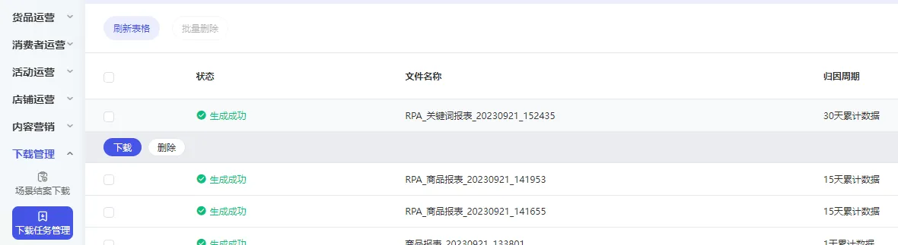

# 基础报表-营销场景报表下载
# 描述

点击【下载报表】，在下载任务管理中点击【下载】

# 配置说明
适用的浏览器类型Google Chrome浏览器

## 输入

网页对象：已打开的浏览器对象

日期类型：可选择页面上的快捷日期或者自定义日期

自定义 /  昨日 / 上周  / 本月  / 上月  /  过去7天  /  过去15天  /  过去30天

归因模型_转化统计方式：可选择想要的转化统计方式

末日点击归因  /  按转化时间  /  MTA归因

归因周期_转化统计周期：可选择想要的转化统计周期

1天累计数据  /  3天累计数据  /  7天累计数据  /  15天累计数据  /  30天累计数据

时间粒度：可选择想要的时间粒度

汇总  / 分时  /  分日  /  分周  /  分月  /  分自然月

报表模版：可选择想要的报表模版

全部计划  / 关键词推广  /  人群推广  /  货品运营  /  店铺直达  /  内容场景  /  货品全站推

开始时间：选择想要取数的自定义时间开始点

结束时间：选择想要取数的自定义时间结束点

保存文件夹：请输入数据文件保存的文件夹路径

## 输出

下载文件完整路径：输出数据文件的路径

<Info>
  使用指令过程中遇到问题？前往 [八爪鱼RPA 开发者社区问答板块](https://rpa.bazhuayu.com/community/questions) 提问，获取官方与社区帮助。
</Info>
