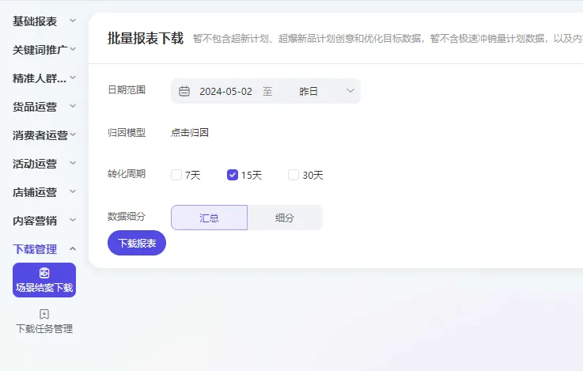

# 下载管理-场景结案下载
# 描述

点击【下载管理】，在下载任务管理中点击【场景结案下载】

# 配置说明
适用的浏览器类型Google Chrome浏览器

## 输入

网页对象：已打开的浏览器对象

日期类型：可选择页面上的快捷日期或者自定义日期

自定义 /  昨日 / 上周  / 本月  / 上月  /  过去7天  /  过去15天  /  过去30天

转化周期：可选择想要的转化周期

7天 /  15天  /  30天

时间粒度：可选择想要的时间粒度

汇总    /  细分

开始时间：选择想要取数的自定义时间开始点

结束时间：选择想要取数的自定义时间结束点

保存文件夹：请输入数据文件保存的文件夹路径

## 输出

下载文件完整路径：输出数据文件的路径

<Info>
  使用指令过程中遇到问题？前往 [八爪鱼RPA 开发者社区问答板块](https://rpa.bazhuayu.com/community/questions) 提问，获取官方与社区帮助。
</Info>
