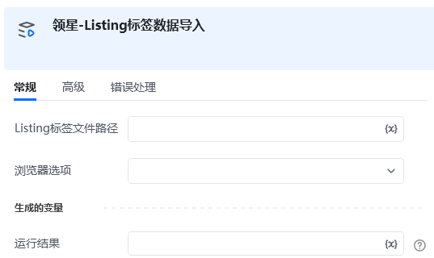

<strong>指令描述：</strong>

导入Listing标签数据

<strong>输入：</strong>

Listing标签文件路径：传入Listing的绝对路径

浏览器选项：Edge/Chrome

<strong>输出：</strong>

<Info>
  使用指令过程中遇到问题？前往 [八爪鱼RPA 开发者社区问答板块](https://rpa.bazhuayu.com/community/questions) 提问，获取官方与社区帮助。
</Info>
