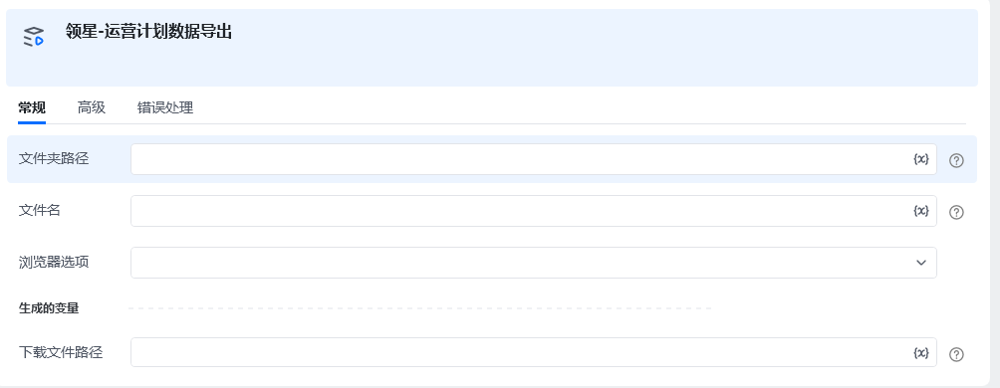

**指令描述：**

**        **导出运营计划页面的数据
        

**输入：**

    文件夹路径：导出后文件存储的路径 例：D:\test\

    文件名：文件名称

    浏览器选项：Edge/Chrome

**输出：**

<Info>
  使用指令过程中遇到问题？前往 [八爪鱼RPA 开发者社区问答板块](https://rpa.bazhuayu.com/community/questions) 提问，获取官方与社区帮助。
</Info>
