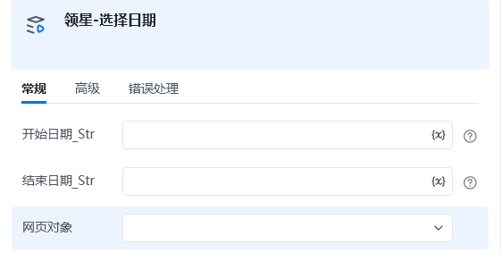

<strong>指令描述：</strong>

日期选择器

<strong>输入：</strong>

开始日期：yyyy-MM-dd

结束日期：yyyy-MM-dd

网页对象

不支持的网页：

销售-运营计划

客服-店铺绩效

财务-利润报表

财务-业绩报表

财务-应收报告

财务-发货结算报告

财务-成本诊断

财务-期初成本调整

设置-汇率管理

<Info>
  使用指令过程中遇到问题？前往 [八爪鱼RPA 开发者社区问答板块](https://rpa.bazhuayu.com/community/questions) 提问，获取官方与社区帮助。
</Info>
