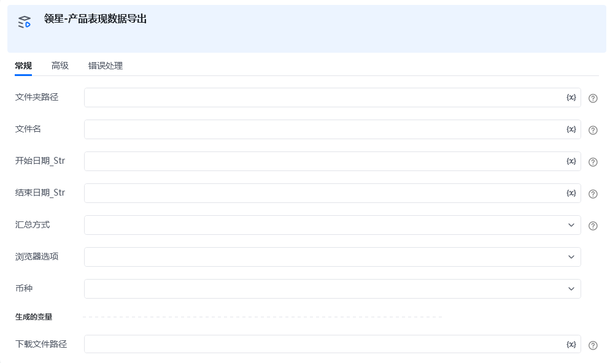

**指令描述：**

**        **按日期/汇总方式/币种/,导出领星产品表现数据

**输入：**

    文件夹路径：导出后文件存储的路径 例：D:\test\

    文件名：文件名称

    开始日期：yyyy-MM-dd

    结束日期：yyyy-MM-dd

    汇总方式：根据实际需要的表格，选择下拉框

    浏览器选项：Edge/Chrome

    币种：导出后数据显示的币种

**输出：**

<Info>
  使用指令过程中遇到问题？前往 [八爪鱼RPA 开发者社区问答板块](https://rpa.bazhuayu.com/community/questions) 提问，获取官方与社区帮助。
</Info>
