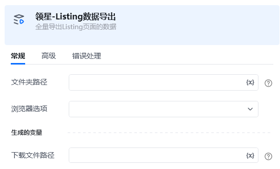

<strong>指令描述：</strong>

导出Listing页面数据

<strong>输入：</strong>

文件夹路径：导出后文件存储的路径 例：D:\test\

文件名：文件名称

浏览器选项：Edge/Chrome

<strong>输出：</strong>

<Info>
  使用指令过程中遇到问题？前往 [八爪鱼RPA 开发者社区问答板块](https://rpa.bazhuayu.com/community/questions) 提问，获取官方与社区帮助。
</Info>
