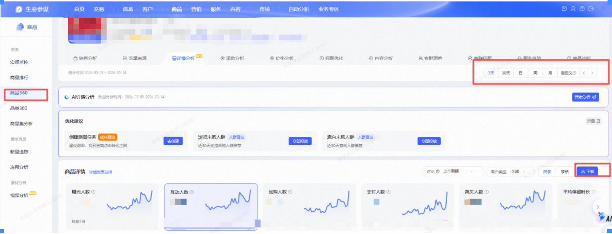
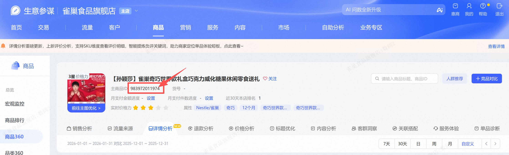
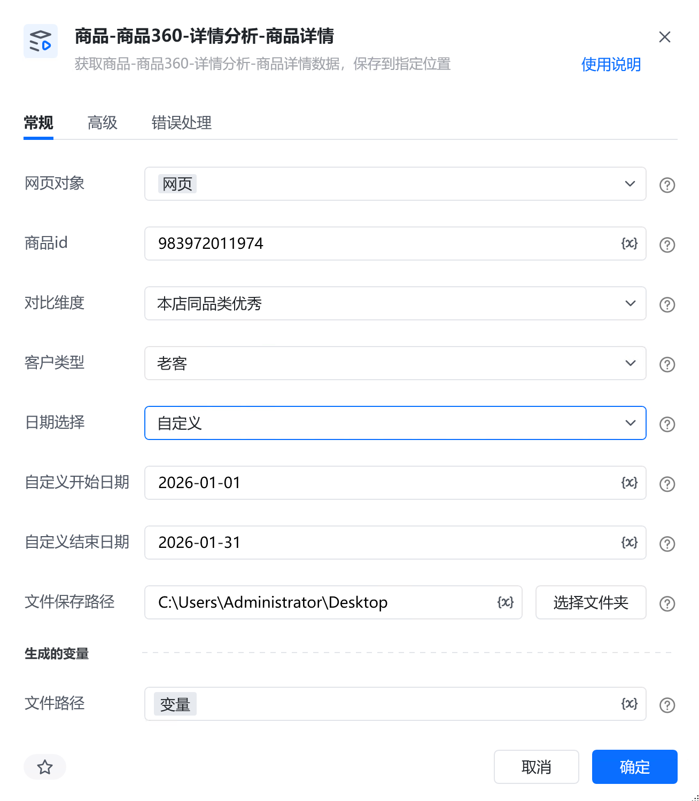
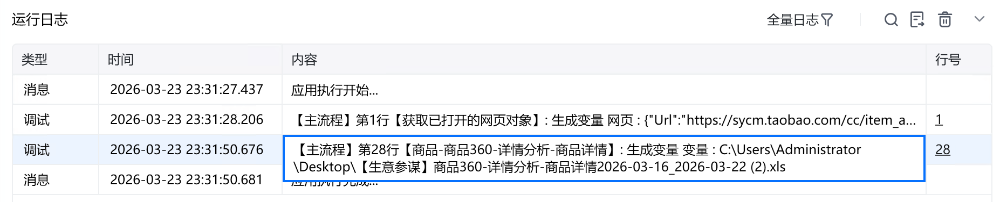

# 描述

获取商品-商品360-详情分析-商品详情数据，保存到指定位置

# 配置说明
## 输入

<strong>网页对象:</strong>

任意一个已登录生意参谋的网页对象

<strong>商品id:</strong>

填写商品id

<strong>对比维度:</strong>

选择对比维度

<strong>客户类型:</strong>

选择客户类型

<strong>日期选择:</strong>

选择日期范围

<strong>自定义开始日期:</strong>

最少选择 1 天，最多选择 31 天，格式必须为：YYYY-MM-DD

<strong>自定义结束日期:</strong>

最少选择 1 天，最多选择 31 天，格式必须为：YYYY-MM-DD

<strong>文件保存路径：</strong>

选择文件保存路径

<strong>自定义文件名称：</strong>

自定义文件名称，若不填则使用默认文件名
## 输出

<strong>文件路径：</strong>

输出完整的文件路径，文本类型
# 使用示例

# 运行结果

<Info>
  使用指令过程中遇到问题？前往 [八爪鱼RPA 开发者社区问答板块](https://rpa.bazhuayu.com/community/questions) 提问，获取官方与社区帮助。
</Info>
