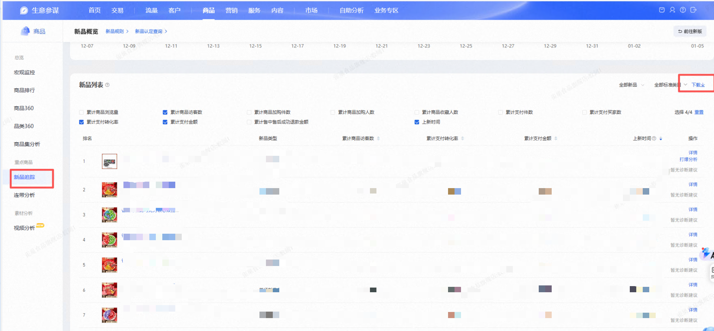
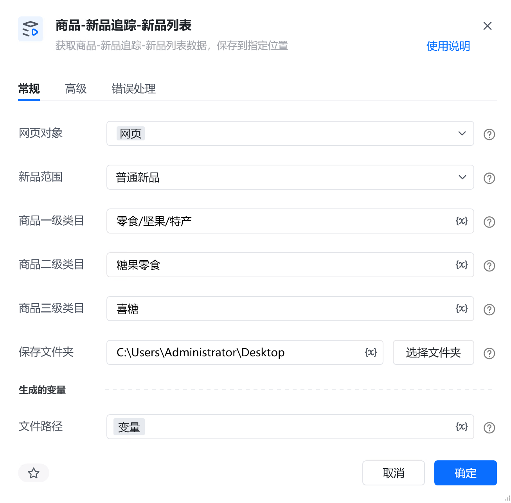
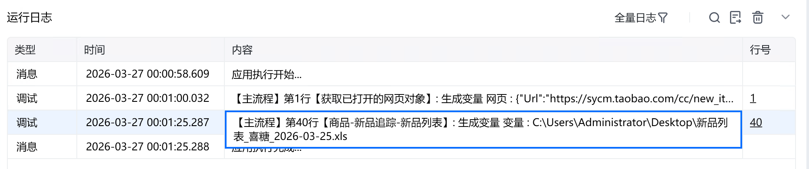

# 描述

获取商品-新品追踪-新品列表数据，保存到指定位置

# 配置说明
## 输入

<strong>网页对象:</strong>

任意一个已登录生意参谋的网页对象

<strong>新品范围:</strong>

选择新品范围

<strong>商品一级类目:</strong>

填写新品一级类目，必须与平台的类目名称一致。选填，若不填则默认一级全部

<strong>商品二级类目:</strong>

填写新品二级类目，必须与平台的类目名称一致。选填，若不填则默认二级全部

<strong>商品三级类目:</strong>

填写新品三级类目，必须与平台的类目名称一致。选填，若不填则默认三级全部

<strong>保存文件夹：</strong>

选择文件保存路径

<strong>自定义文件名称：</strong>

自定义文件名称，若不填则使用默认文件名
## 输出

<strong>文件路径：</strong>

输出完整的文件路径，文本类型
# 使用示例

# 运行结果

<Info>
  使用指令过程中遇到问题？前往 [八爪鱼RPA 开发者社区问答板块](https://rpa.bazhuayu.com/community/questions) 提问，获取官方与社区帮助。
</Info>
