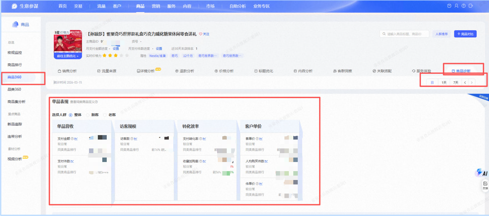
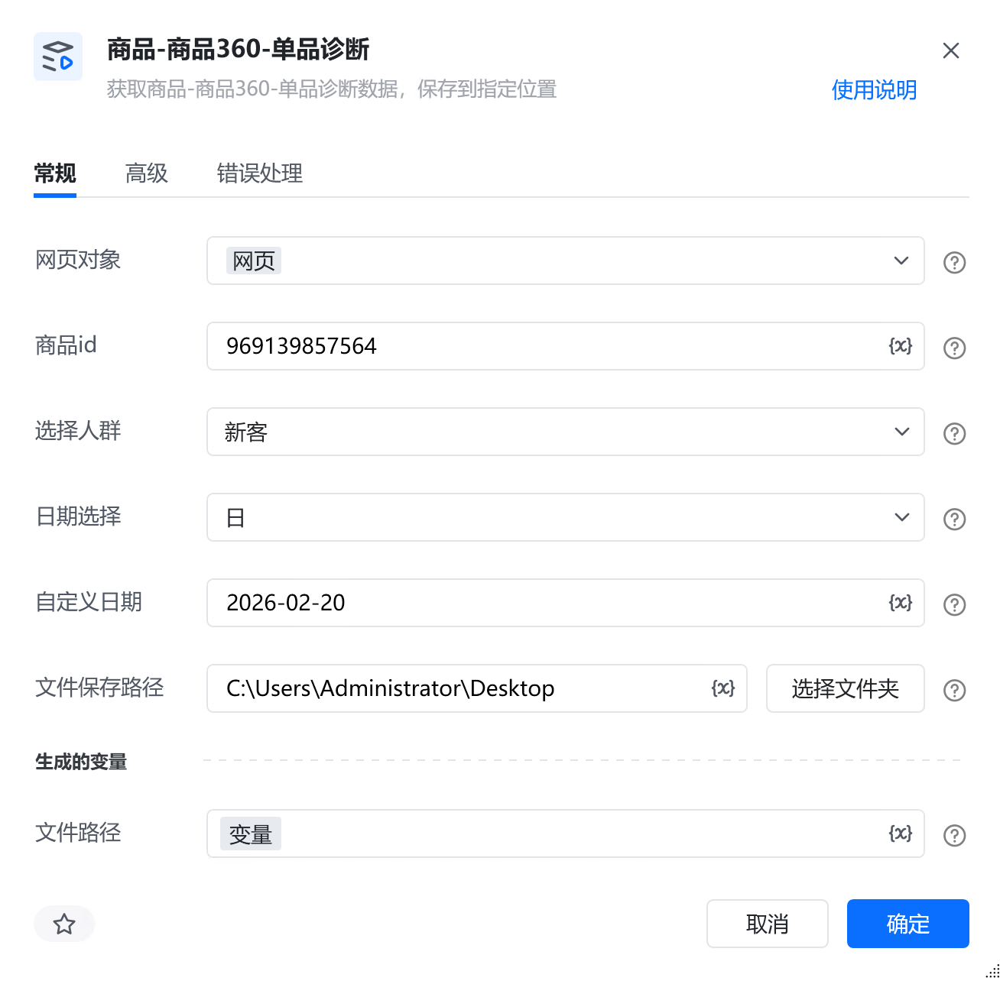
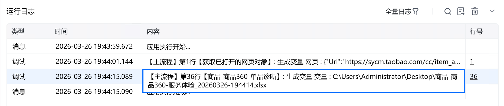
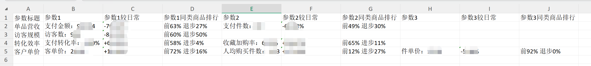

# 描述

获取商品-商品360-单品诊断数据，保存到指定位置

# 配置说明
## 输入

<strong>网页对象:</strong>

任意一个已登录生意参谋的网页对象

<strong>商品id:</strong>

填写商品id

<strong>选择人群:</strong>

选择人群

<strong>日期选择:</strong>

选择日期范围

<strong>自定义日期:</strong>

自定义日期，格式必须为：YYYY-MM-DD

<strong>保存文件夹：</strong>

选择文件保存路径

<strong>自定义文件名称：</strong>

自定义文件名称，若不填则使用默认文件名
## 输出

<strong>文件路径：</strong>

输出完整的文件路径，文本类型
# 使用示例

# 运行结果

<Info>
  使用指令过程中遇到问题？前往 [八爪鱼RPA 开发者社区问答板块](https://rpa.bazhuayu.com/community/questions) 提问，获取官方与社区帮助。
</Info>
