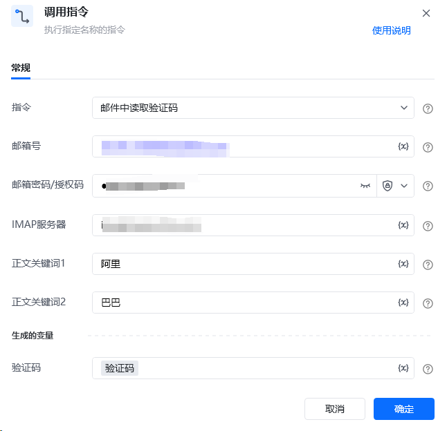

# <strong>“邮件中读取验证码” RPA 自定义指令说明 </strong>
## <strong>一、指令概述 </strong>

该 RPA 自定义指令用于通过邮件协议（依托 IMAP 服务器 ），登录指定邮箱，依据设定的正文关键词筛选邮件，自动提取邮件中的验证码内容并存储，实现验证码获取的自动化流程，适配账号注册、登录验证等需邮件验证码的场景。
## <strong>二、调用参数配置示意 </strong>

在 RPA 流程设计中，通过 “调用指令” 配置参数执行邮件验证码读取操作，配置界面如下：

参数名称说明指令选择 “邮件中读取验证码”，执行邮件验证码提取流程邮箱号需登录的目标邮箱地址（如 xxx@xx.com ），用于定位邮箱邮箱密码 / 授权码邮箱登录密码或开启 IMAP 等服务后生成的授权码，验证登录权限IMAP 服务器邮箱对应的 IMAP 服务器地址（如网易邮箱 imap.163.com ），建立邮件连接正文关键词 1 / 正文关键词 2用于筛选目标邮件的关键词，需包含验证码所在邮件正文中的特征文本，支持多关键词组合匹配生成的变量 - 验证码存储提取到的验证码内容的变量，供后续流程调用
## <strong>三、使用示例 </strong>
### <strong>（一）参数配置 </strong>

• 邮箱号：example@163.com（目标邮箱地址 ）

• 邮箱密码 / 授权码：{邮箱授权码变量}（提前获取的邮箱授权码，确保登录权限 ）

• IMAP 服务器：imap.163.com（网易邮箱 IMAP 服务器地址 ）

• 正文关键词 1：您的验证码是（邮件正文中提示验证码的特征文本 ）

• 正文关键词 2：有效期（辅助筛选，确保定位到含验证码的目标邮件 ）

• 生成的变量 - 验证码：验证码（存储提取结果的变量 ）

•验证码文本示例：

【文件解密验证码】【京东】以taskid-76891277-开头的加密导出文件，密码（区分大小写）是：R*6pRFS9y2

【登录验证码】【天猫店】【阿里巴巴】验证码487637，您正在登录验证，切勿将验证码泄露于他人，验证码15分钟内有效。
### <strong>（二）执行流程 </strong>

调用指令后，RPA 工具按以下步骤运行：

1. 依托配置的 IMAP 服务器 地址，使用 邮箱号 和 邮箱密码/授权码 登录目标邮箱；

2. 遍历邮箱收件箱（或指定文件夹 ）邮件，筛选出正文同时包含 正文关键词 1 和 正文关键词 2 的邮件；

3. 从匹配邮件正文中提取验证码内容（通常为数字或字符组合 ），存入 验证码 变量。
## <strong>四、运行效果 </strong>

执行成功后，生成的 验证码 变量会存储提取到的验证码内容。若邮件正文中含 “您的验证码是 123456，有效期 5 分钟”，且关键词匹配，变量值则为 123456 。可通过查看变量值或流程日志验证，示例效果如下：

（注：图中变量显示验证码为 123456 ，验证指令成功提取邮件验证码 ）
## <strong>五、注意事项 </strong>

1. <strong>邮箱权限</strong>：需确保邮箱已开启 IMAP 服务（部分邮箱默认关闭 ），且 邮箱密码/授权码 正确，否则无法登录邮箱。

2. <strong>关键词精准性</strong>：正文关键词 需准确匹配目标邮件特征，避免因关键词宽泛匹配到无关邮件，或因关键词遗漏无法定位邮件。

3. <strong>邮件及时性</strong>：验证码邮件需在指令执行时已收到并处于可读取状态（未被删除、移动 ），否则可能提取失败。

4. <strong>服务器适配</strong>：不同邮箱服务商的 IMAP 服务器 地址不同（如 QQ 邮箱为 imap.qq.com ），需准确填写。
## <strong>六、延伸应用 </strong>

该指令可结合多种业务流程，拓展自动化场景：

• <strong>账号注册自动化</strong>：在注册流程中，自动读取邮箱验证码并填入注册页面，完成自动化注册。

• <strong>登录验证流程</strong>：搭配登录操作，读取邮件验证码实现自动化登录，跳过手动查收验证码步骤。

• <strong>业务系统验证</strong>：在财务、OA 等系统的身份验证环节，自动提取邮件验证码完成校验，提升流程效率。

<Info>
  使用指令过程中遇到问题？前往 [八爪鱼RPA 开发者社区问答板块](https://rpa.bazhuayu.com/community/questions) 提问，获取官方与社区帮助。
</Info>
