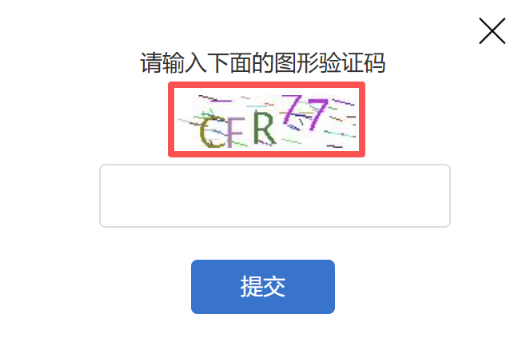
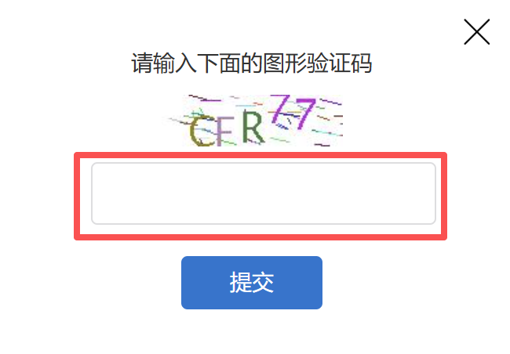
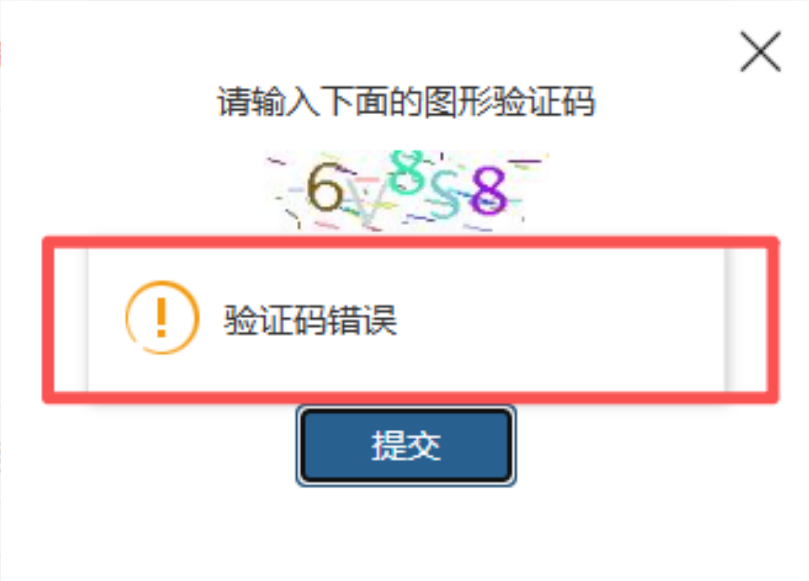
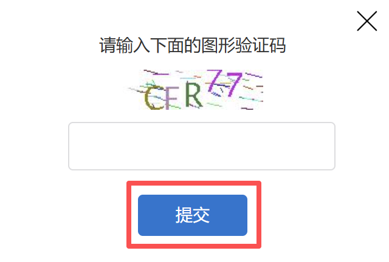

#
描述

用于自动处理纯数字、纯字母、数字 + 字母类验证码

#
配置说明
##
输入

<strong>网页对象:</strong>

任意一个需要处理验证码的网页对象

<strong>验证码照片:</strong>

字符验证码的图片元素，如图

<strong>验证码输入框:</strong>

输入识别结果的输入框，如图

<strong>识别失败提示：</strong>

当验证失败时，页面出现的提示信息，用于验证是否验证成功

<strong>提交验证码按钮：</strong>

提交验证码的按钮元素，如图

<strong>重试次数:</strong>

当验证失败时，最大重试次数，选填，若不填默认10次
##
输出

<Info>
  使用指令过程中遇到问题？前往 [八爪鱼RPA 开发者社区问答板块](https://rpa.bazhuayu.com/community/questions) 提问，获取官方与社区帮助。
</Info>
