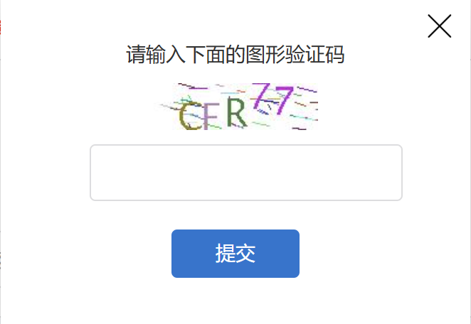
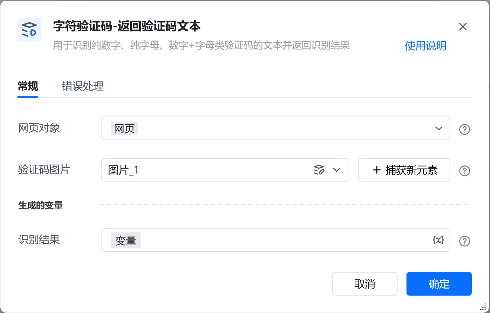
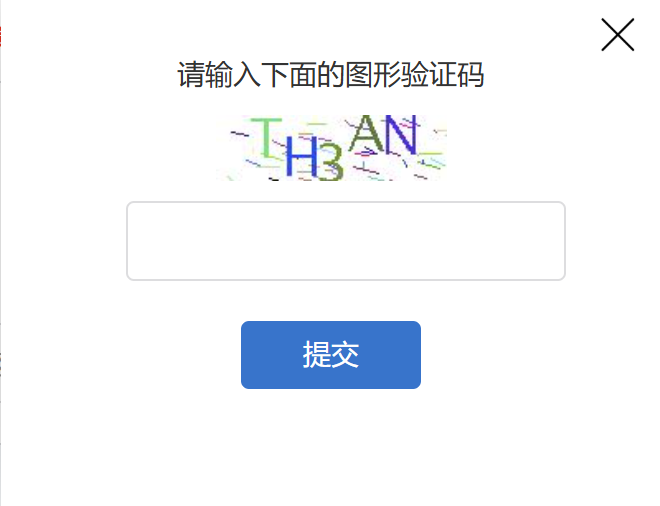
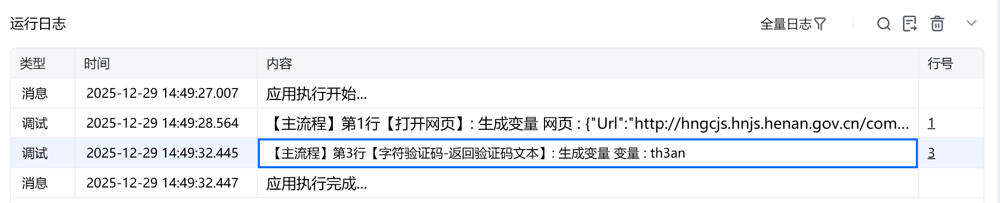

#
描述

用于识别纯数字、纯字母、数字+字母类验证码的文本并返回识别结果

#
配置说明
##
输入

<strong>网页对象:</strong>

任意一个需要处理验证码的网页对象

<strong>验证码图片:</strong>

字符验证码的图片元素，如图

##
输出

<strong>识别结果:</strong>

输出验证码识别的结果，文本类型
#
使用示例

<Info>
  使用指令过程中遇到问题？前往 [八爪鱼RPA 开发者社区问答板块](https://rpa.bazhuayu.com/community/questions) 提问，获取官方与社区帮助。
</Info>
