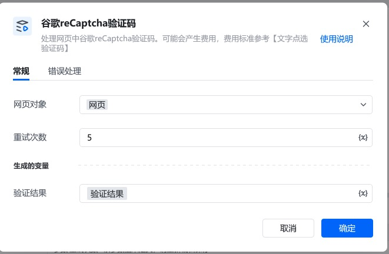
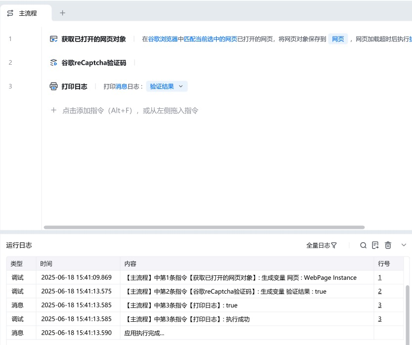
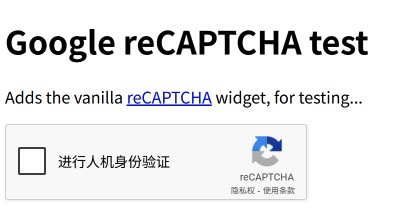
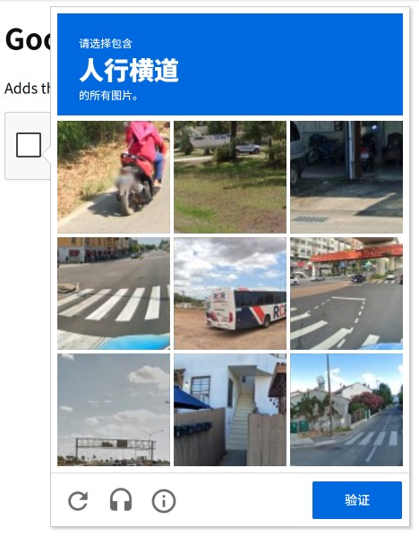

##
指令说明

处理网页中谷歌reCaptcha验证码。可能会产生费用，费用标准参考【文字点选验证码[文字点选验证码](https://rpa.bazhuayu.com/helpcenter/docs/recognizetextclickcommand)】

##
使用示例

验证过程中如果出现九宫格/十六宫格验证，会产生费用，每重试一次产生一次费用。

<Info>
  使用指令过程中遇到问题？前往 [八爪鱼RPA 开发者社区问答板块](https://rpa.bazhuayu.com/community/questions) 提问，获取官方与社区帮助。
</Info>
