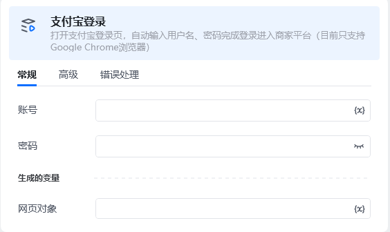

### 描述

打开支付宝登录页，自动输入用户名、密码完成登录进入商家平台（目前只支持Google Chrome浏览器）

浏览器类型Google Chrome浏览器

### 输入

账号：支付宝登录账号

密码：支付宝登录密码
### 输出

保存网页对象至：存储商家平台网页对象至变量，后续流程用到该网页时，可直接调用该变量

<Info>
  使用指令过程中遇到问题？前往 [八爪鱼RPA 开发者社区问答板块](https://rpa.bazhuayu.com/community/questions) 提问，获取官方与社区帮助。
</Info>
