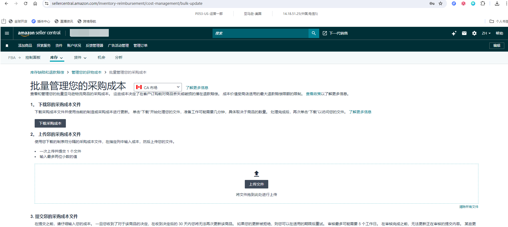
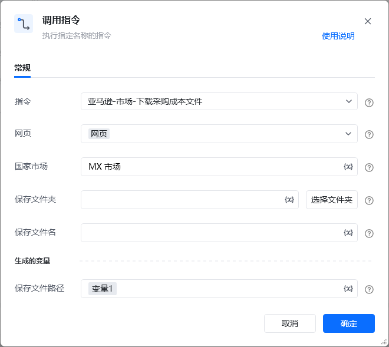

## 描述

该指令实现了亚马逊中批量管理您的采购成本页面中的文件下载
## 参数配置
### 指令输入

<strong>参数字段: </strong><em>类型；</em>参数描述
#### 常规

<strong>网页对象: </strong><em>web对象；</em>待操作的网页对象

<strong>国家市场: </strong><em>字符串；</em>国家市场的名称，例：CA 市场，US 市场

<strong>保存文件夹: </strong><em>字符串；</em>下载文件保存的文件夹目录

<strong>保存文件名: </strong><em>字符串；</em>下载文件保存的文件名称，默认：国家站点+日期时间
### 指令输出

<strong>保存文件路径: </strong><em>字符串；</em>保存文件的路径
## 参考案例
### 场景

<strong>场景描述</strong>

https://sellercentral.amazon.com/inventory-reimbursement/cost-management/bulk-update[https://sellercentral.amazon.com/inventory-reimbursement/cost-management/bulk-update](https://sellercentral.amazon.com/inventory-reimbursement/cost-management/bulk-update)

<strong>关键指令配置</strong>

<strong>运行结果</strong>

<Info>
  使用指令过程中遇到问题？前往 [八爪鱼RPA 开发者社区问答板块](https://rpa.bazhuayu.com/community/questions) 提问，获取官方与社区帮助。
</Info>
