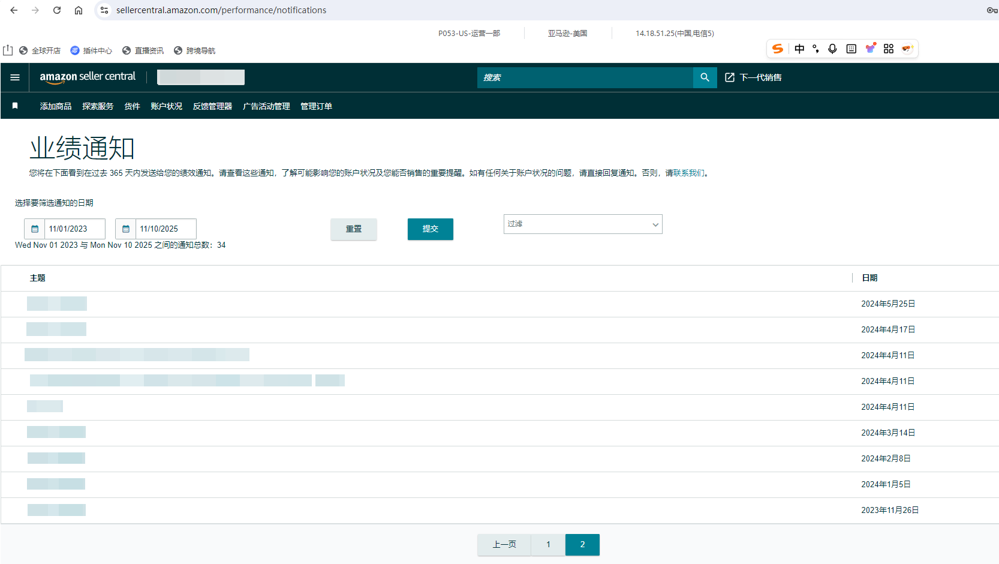
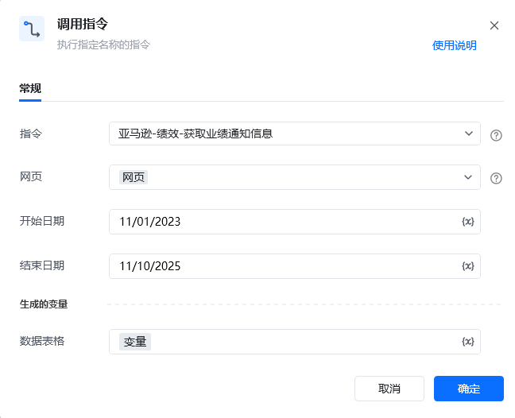
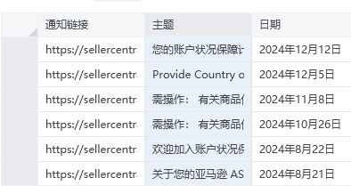

## 描述

该指令实现了获取亚马逊绩效中绩效通知的业绩通知信息
## 参数配置
### 指令输入

<strong>参数字段: </strong><em>类型；</em>参数描述
#### 常规

<strong>网页对象: </strong><em>web对象；</em>待操作的网页对象

<strong>开始日期: </strong><em>业绩通知的开始日期；</em>格式：MM/DD/YYYY，例如：11/01/2023

<strong>结束日期: </strong><em>业绩通知的结束日期；</em>格式：MM/DD/YYYY，例如：11/01/2023
### 指令输出

<strong>数据表格: </strong>数据表格<em>数据；</em>保存获取信息的变量
## 参考案例
### 场景

<strong>场景描述</strong>

从亚马逊绩效中获取绩效通知的业绩通知信息

<strong>指令配置</strong>

<strong>运行结果</strong>

<Info>
  使用指令过程中遇到问题？前往 [八爪鱼RPA 开发者社区问答板块](https://rpa.bazhuayu.com/community/questions) 提问，获取官方与社区帮助。
</Info>
