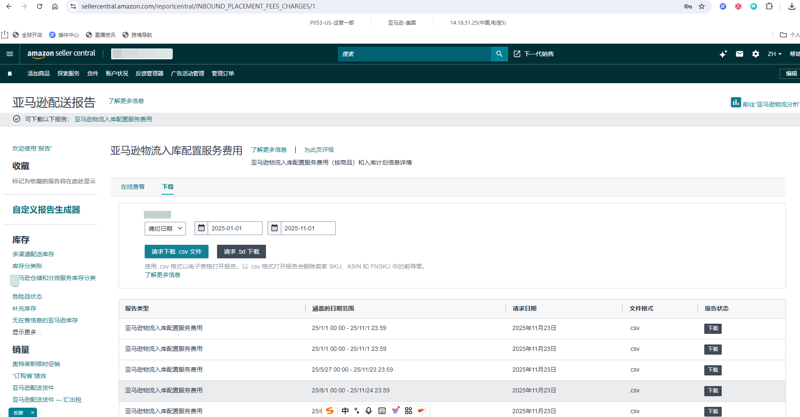
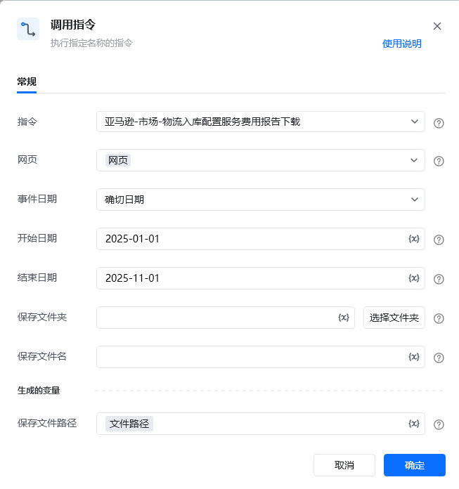

## <strong>描述</strong>

该指令实现了亚马逊配送报告页面中的物流入库配置服务费用报告的下载
### <strong>指令输入</strong>

<strong>参数字段: </strong><em>类型；</em>参数描述
#### <strong>常规</strong>

<strong>网页对象: </strong><em>web对象；</em>待操作的网页对象

<strong>事件日期: </strong><em>字符串；</em>事件的日期，下拉框选择

<strong>开始日期: </strong><em>字符串；</em>报告的开始日期，仅事件日期为'确切日期'时填写，格式为YYYY-MM-dd

<strong>结束日期: </strong><em>字符串；</em>报告的结束日期，仅事件日期为'确切日期'时填写，格式为YYYY-MM-dd

<strong>保存文件夹: </strong><em>字符串；</em>下载文件保存的文件夹目录

<strong>保存文件名: </strong><em>字符串；</em>下载文件保存的文件名称
### <strong>指令输出</strong>

<strong>保存文件路径: </strong><em>字符串；</em>保存下载文件的路径
### <strong>场景</strong>

https://sellercentral.amazon.com/reportcentral/INBOUND_PLACEMENT_FEES_CHARGES/1[https://sellercentral.amazon.com/reportcentral/INBOUND_PLACEMENT_FEES_CHARGES/1](https://sellercentral.amazon.com/reportcentral/INBOUND_PLACEMENT_FEES_CHARGES/1)

<strong>关键指令配置</strong>

<strong>运行结果</strong>

<Info>
  使用指令过程中遇到问题？前往 [八爪鱼RPA 开发者社区问答板块](https://rpa.bazhuayu.com/community/questions) 提问，获取官方与社区帮助。
</Info>
