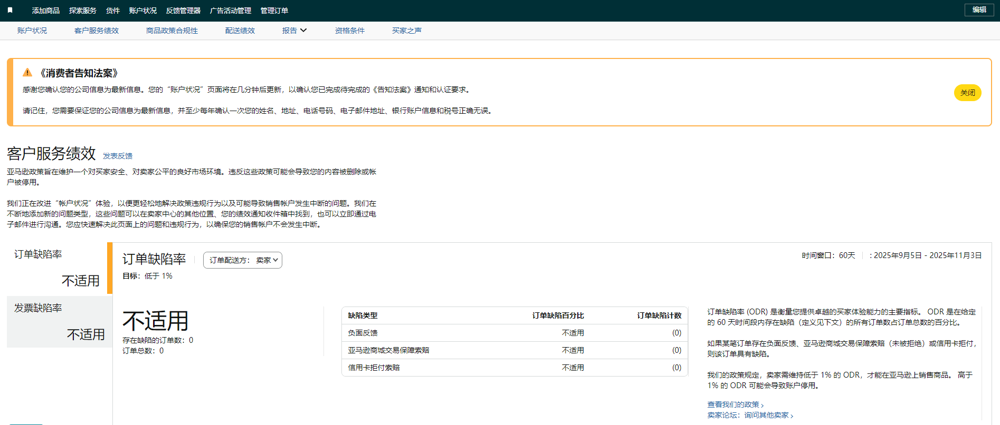
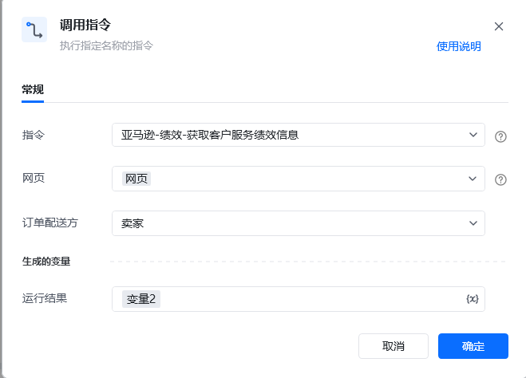

## 描述

该指令实现了获取亚马逊绩效中账户状况的客户服务绩效信息
## <strong>参数配置</strong>
### <strong>指令输入</strong>

<strong>参数字段: </strong><em>类型；</em>参数描述
#### <strong>常规</strong>

<strong>网页对象: </strong><em>web对象；</em>待操作的网页对象

<strong>订单配送方：</strong>亚马逊/卖家
### <strong>指令输出</strong>

<strong>保存信息至: </strong><em>字典；</em>保存获取信息的变量
## <strong>参考案例</strong>
### <strong>场景</strong>

<strong>场景描述</strong>

从亚马逊绩效中获取账户状况的客户服务绩效信息

<strong>关键指令配置</strong>

<strong>运行结果</strong>

\{

"负面反馈": "不适用",

"亚马逊商城交易保障索赔": "不适用",

"信用卡拒付索赔": "不适用",

"订单缺陷率目标": "低于 1%",

"订单缺陷率": "不适用",

"存在缺陷的订单数": "0",

"订单总数": "0"

<Info>
  使用指令过程中遇到问题？前往 [八爪鱼RPA 开发者社区问答板块](https://rpa.bazhuayu.com/community/questions) 提问，获取官方与社区帮助。
</Info>
