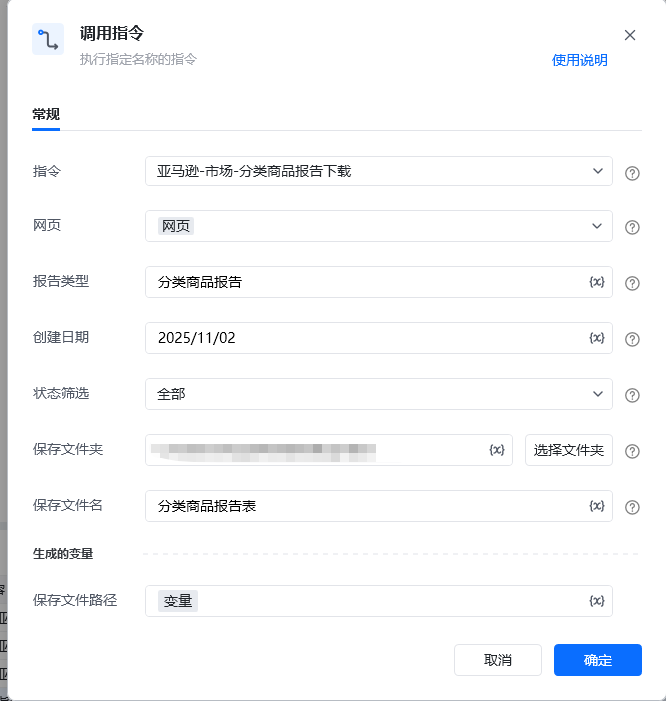
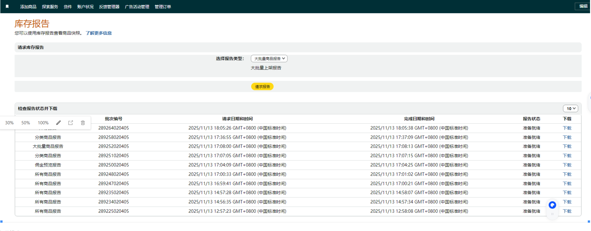

## 描述

该指令实现了对亚马逊分类商品报告的下载
## 参数配置
### 指令输入

<strong>参数字段: </strong><em>类型；</em>参数描述
#### 常规

<strong>网页对象: </strong><em>web对象；</em>待操作的网页对象

<strong>报告类型: </strong><em>字符串；</em>亚马逊库存报告中的报告类型

<strong>创建日期: </strong><em>字符串；</em>分类商品报告中商品创建日期晚于的日期，格式为YYYY/MM/DD，例：2025/07/30

<strong>状态筛选: </strong><em>字符串；</em>分类商品报告中的状态筛选条件，支持全部，在售，不可售，不完整，不可售（缺货）

<strong>保存文件夹: </strong><em>字符串；</em>导出文件保存的文件夹目录

<strong>保存文件名: </strong><em>字符串；</em>导出文件保存的文件名称
### 指令输出

<strong>保存文件路径: </strong><em>字符串；</em>保存文件的路径
## 参考案例

### 场景

<strong>场景描述</strong>

<Info>
  使用指令过程中遇到问题？前往 [八爪鱼RPA 开发者社区问答板块](https://rpa.bazhuayu.com/community/questions) 提问，获取官方与社区帮助。
</Info>
