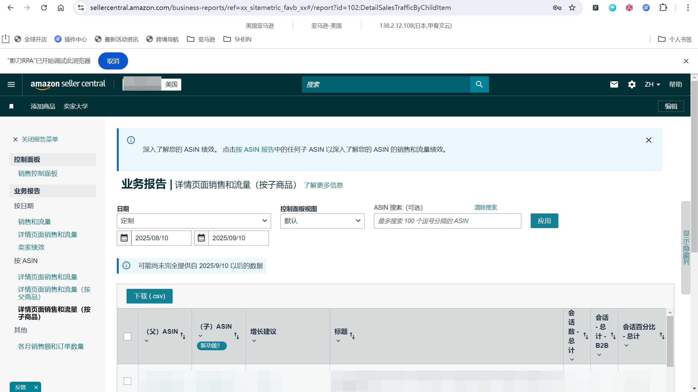
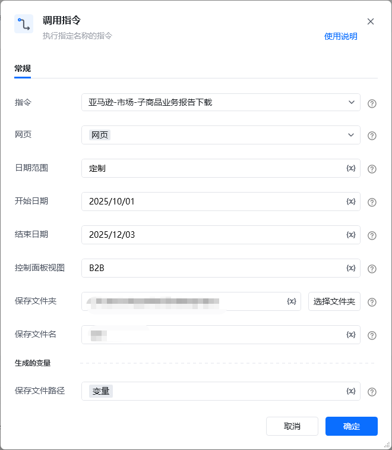

## 描述
该指令实现了亚马逊的业务报告中详情页面销售和流量（按子商品）报告的下载功能

## 参数配置
### 指令输入

<strong>参数字段: </strong><em>类型；</em>参数描述
#### 常规

<strong>网页对象: </strong><em>web对象；</em>待操作的网页对象

<strong>日期范围: </strong><em>字符串；</em>日期的范围，可选项：昨天、本周至今、本月至今、年初至今、定制

<strong>开始日期: </strong><em>字符串；</em>报告的开始日期，仅事件日期为'定制'时填写，格式为YYYY/MM/dd

<strong>结束日期: </strong><em>字符串；</em>报告的结束日期，仅事件日期为'定制'时填写，格式为YYYY/MM/dd

<strong>控制面板视图: </strong><em>字符串；</em>控制面板视图的名称，可选项：默认，所有列，B2B

<strong>保存文件夹: </strong><em>字符串；</em>下载文件保存的文件夹目录

<strong>保存文件名: </strong><em>字符串；</em>下载文件保存的文件名称，默认：日期范围+报告类型
### 指令输出

<strong>保存下载文件路径至: </strong><em>字符串；</em>保存下载文件的路径
## 参考案例
### 场景

https://sellercentral.amazon.com/[https://sellercentral.amazon.com/](https://sellercentral.amazon.com/)business-reports/ref=xx_sitemetric_favb_xx#/report?id=102:DetailSalesTrafficByChildItem
从亚马逊的业务报告中下载详情页面销售和流量（按子商品）报告

<strong>参考流程</strong>

<Info>
  使用指令过程中遇到问题？前往 [八爪鱼RPA 开发者社区问答板块](https://rpa.bazhuayu.com/community/questions) 提问，获取官方与社区帮助。
</Info>
