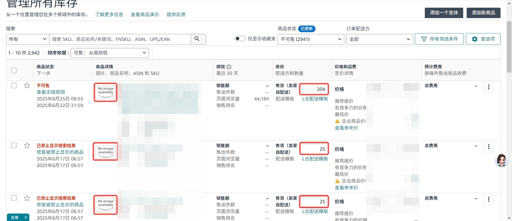
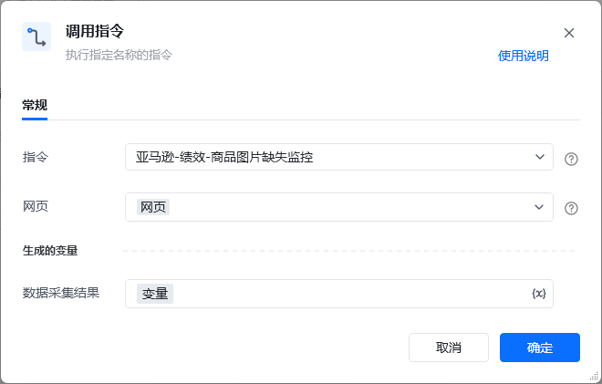
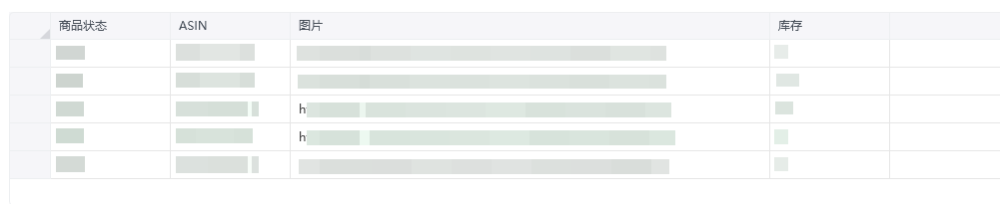

## 描述

该指令获取库存页面缺失图片的ASIN
## 参数配置
### 指令输入

<strong>参数字段: </strong><em>类型；</em>参数描述
#### 常规

<strong>网页对象：</strong><em>web对象,</em>待操作的网页对象
### 指令输出

<em><strong>数据采集结果</strong></em><em>，数据表格</em>
## 参考案例

<strong>场景描述</strong>

https://sellercentral.amazon.com/myinventory/inventory[https://sellercentral.amazon.com/myinventory/inventory](https://sellercentral.amazon.com/myinventory/inventory)
筛查库存数量不为0，且无图片信息的商品的ASIN

<strong>参考流程</strong>

<strong>运行结果</strong>

<Info>
  使用指令过程中遇到问题？前往 [八爪鱼RPA 开发者社区问答板块](https://rpa.bazhuayu.com/community/questions) 提问，获取官方与社区帮助。
</Info>
