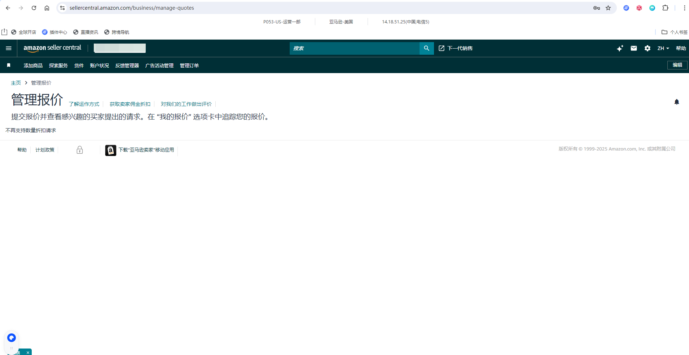
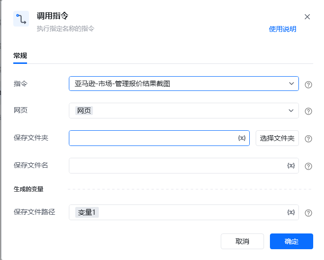

## <strong>描述</strong>

该指令实现了亚马逊管理报价页面的结果截图
### <strong>指令输入</strong>

<strong>参数字段: </strong><em>类型；</em>参数描述
#### <strong>常规</strong>

<strong>网页对象: </strong><em>web对象；</em>待操作的网页对象

<strong>保存文件夹: </strong><em>字符串；</em>截图文件保存的文件夹目录

<strong>保存文件名: </strong><em>字符串；</em>截图文件保存的文件名称
### <strong>指令输出</strong>

<strong>保存文件路径: </strong><em>字符串；</em>保存截图文件的路径
### <strong>场景</strong>

https://sellercentral.amazon.com/business/manage-quotes[https://sellercentral.amazon.com/business/manage-quotes](https://sellercentral.amazon.com/business/manage-quotes)

<strong>关键指令配置</strong>

<Info>
  使用指令过程中遇到问题？前往 [八爪鱼RPA 开发者社区问答板块](https://rpa.bazhuayu.com/community/questions) 提问，获取官方与社区帮助。
</Info>
