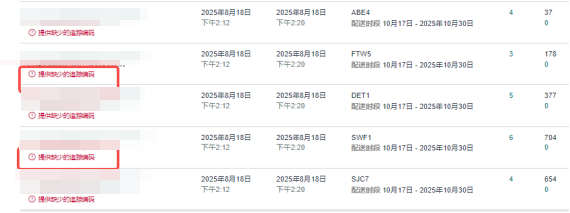
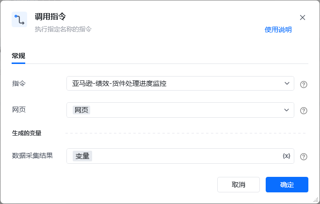
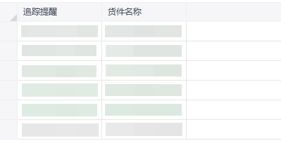

## 描述

该指令获取亚马逊-库存-货件页面指定条件下已发货、运输中的存在红色提醒字段数量及货品编码
## 参数配置
### 指令输入

<strong>参数字段: </strong><em>类型；</em>参数描述
#### 常规

<strong>网页：</strong><em>web对象,</em>待操作的网页对象

<strong>采集页数:</strong>填写采集页数，填0默认采集所有页面符合条件的数据
### 指令输出

<strong>数据采集结果：</strong>数据表格
## 参考案例
### 场景

<strong>场景描述</strong>

https://sellercentral.amazon.com/gp/ssof/shipping-queue.html[https://sellercentral.amazon.com/gp/ssof/shipping-queue.html](https://sellercentral.amazon.com/gp/ssof/shipping-queue.html)
从亚马逊-库存-货件页面指定条件下已发货、运输中的存在红色提醒字段数量及其编码

<strong>参考流程</strong>

<strong>运行结果</strong>

<Info>
  使用指令过程中遇到问题？前往 [八爪鱼RPA 开发者社区问答板块](https://rpa.bazhuayu.com/community/questions) 提问，获取官方与社区帮助。
</Info>
