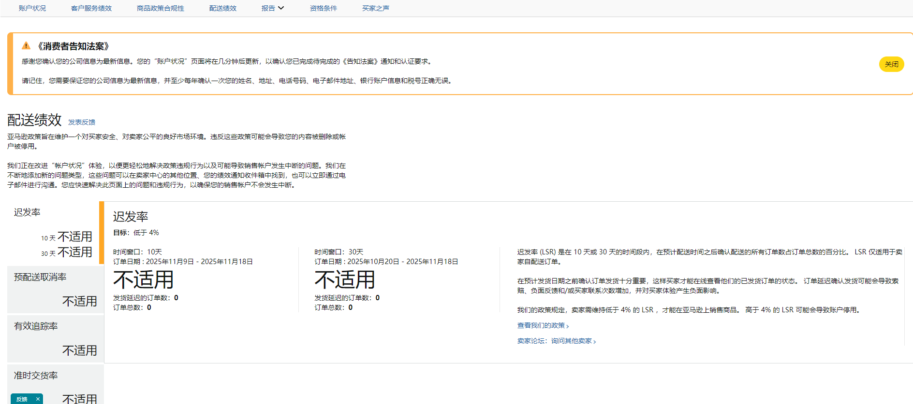
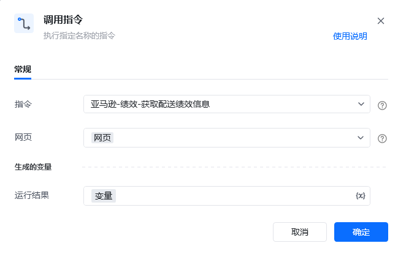

## 描述

该指令实现了获取亚马逊绩效中账户状况的配送绩效信息
## 参数配置
### 指令输入

<strong>参数字段: </strong><em>类型；</em>参数描述
#### 常规

<strong>网页对象: </strong><em>web对象；</em>待操作的网页对象
### 指令输出

<strong>保存信息至: </strong><em>字典；</em>保存获取信息的变量
## 参考案例
### 场景

<strong>场景描述</strong>

从亚马逊绩效中获取账户状况的配送绩效信息

<strong>参考流程</strong>

<strong>运行结果</strong>

\{

"迟发率目标": "低于 4%",

"10天迟发率": "不适用",

"30天迟发率": "不适用",

"预配送取消率目标": "低于 2.5%",

"预配送取消率": "不适用",

"有效追踪率": "不适用",

"有效追踪率目标": "超过 95%",

"准时交货率目标": "高于 90%",

"准时交货率": "不适用"

<Info>
  使用指令过程中遇到问题？前往 [八爪鱼RPA 开发者社区问答板块](https://rpa.bazhuayu.com/community/questions) 提问，获取官方与社区帮助。
</Info>
