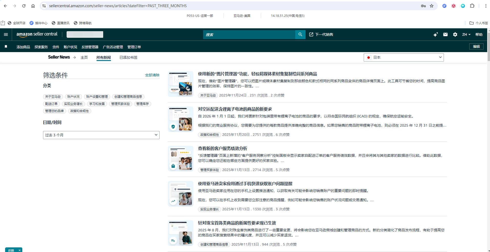
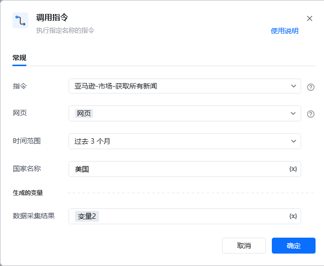
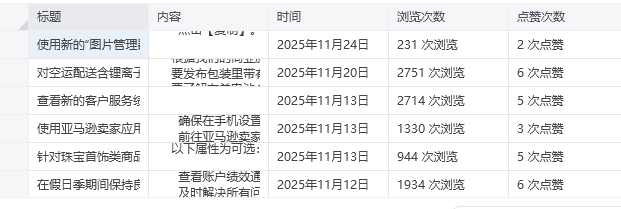

## <strong>描述</strong>

该指令实现了对亚马逊所有新闻页面的新闻内容收集
### <strong>指令输入</strong>

<strong>参数字段: </strong><em>类型；</em>参数描述
#### <strong>常规</strong>

<strong>网页对象: </strong><em>web对象；</em>待操作的网页对象

<strong>国家名称: </strong><em>字符串；</em>国家的名称，例：美国

<strong>日期范围: </strong><em>字符串；</em>新闻的日期范围，可选项：所有时间、过去一周、过去一个月、过去3个月、过去一年
### <strong>指令输出</strong>

<strong>数据采集结果：</strong>数据表格
### <strong>场景</strong>

https://sellercentral.amazon.com/seller-news/articles?dateFilter=PAST_THREE_MONTHS[https://sellercentral.amazon.com/seller-news/articles?dateFilter=PAST_THREE_MONTHS](https://sellercentral.amazon.com/seller-news/articles?dateFilter=PAST_THREE_MONTHS)

<strong>关键指令配置</strong>

<strong>运行结果</strong>

<Info>
  使用指令过程中遇到问题？前往 [八爪鱼RPA 开发者社区问答板块](https://rpa.bazhuayu.com/community/questions) 提问，获取官方与社区帮助。
</Info>
