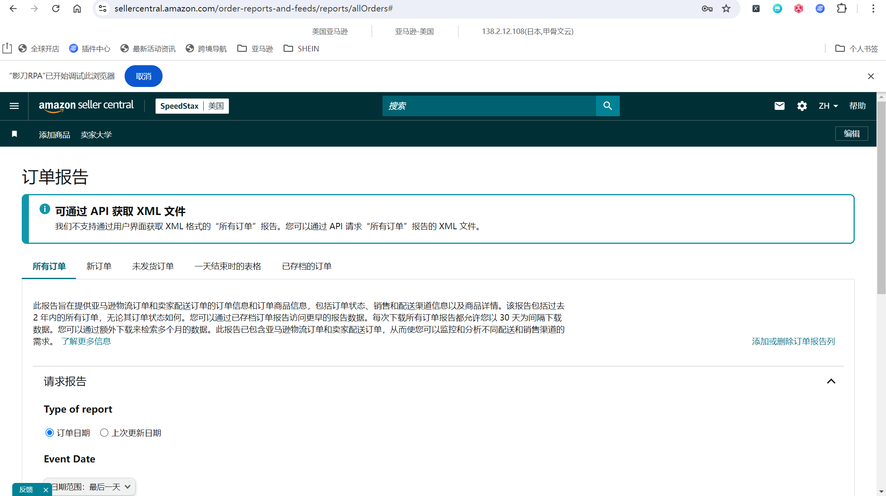
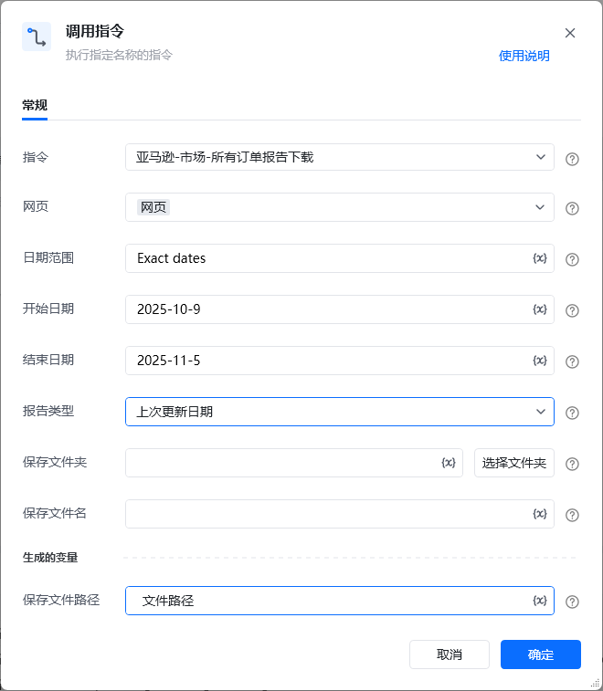

## 描述

该指令实现了亚马逊的订单报告页面中所有订单报告的下载功能
## 参数配置
### 指令输入

<strong>参数字段: </strong><em>类型；</em>参数描述
#### 常规

<strong>网页对象: </strong><em>web对象；</em>待操作的网页对象

<strong>报告类型: </strong><em>字符串；</em>报告的类型，可选项：订单日期，上次更新日期

<strong>日期范围: </strong><em>字符串；</em>事件的日期，填写与页面完全一致的日期范围名称，例如：Date range: Last 3 days、Date range: Last day

<strong>开始日期: </strong><em>字符串；</em>报告的开始日期，仅事件日期为'Exact dates'时填写，格式为YYYY-MM-dd，日期范围不能超过一个月

<strong>结束日期: </strong><em>字符串；</em>报告的结束日期，仅事件日期为'Exact dates'时填写，格式为YYYY-MM-dd，日期范围不能超过一个月

<strong>保存文件夹: </strong><em>字符串；</em>下载文件保存的文件夹目录

<strong>保存文件名: </strong><em>字符串；</em>下载文件保存的文件名称，
### 指令输出

<strong>保存下载文件路径至: </strong><em>字符串；</em>保存下载文件的路径
## 参考案例

<strong>场景描述</strong>

https://sellercentral.amazon.com/order-reports-and-feeds/reports/allOrders[https://sellercentral.amazon.com/order-reports-and-feeds/reports/allOrders](https://sellercentral.amazon.com/order-reports-and-feeds/reports/allOrders)
从亚马逊的订单报告页面中下载所有订单报告

<strong>参考流程</strong>

<strong>运行结果</strong>

<Info>
  使用指令过程中遇到问题？前往 [八爪鱼RPA 开发者社区问答板块](https://rpa.bazhuayu.com/community/questions) 提问，获取官方与社区帮助。
</Info>
