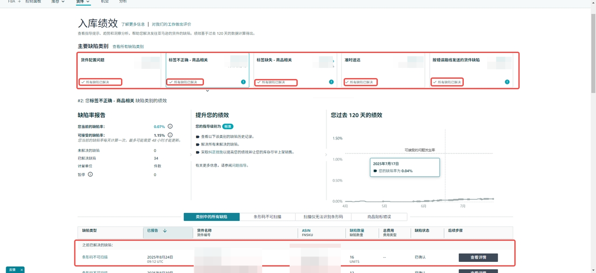
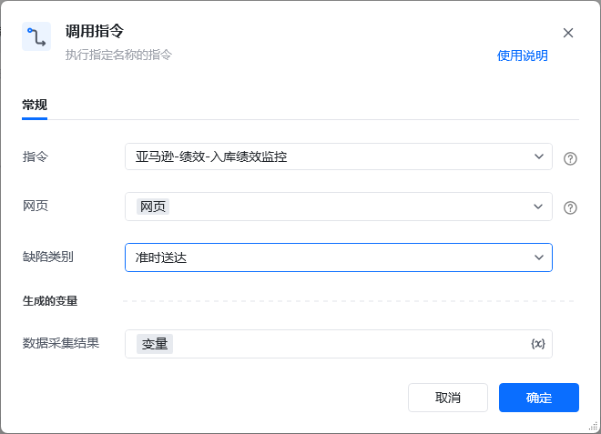
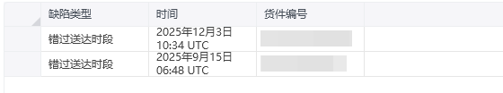

## 描述

该指令获取入库绩效页面存在问题类别的数据
## 参数配置
### 指令输入

<strong>参数字段: </strong><em>类型；</em>参数描述
#### 常规

<strong>网页：</strong><em>web对象,</em>待操作的网页对象

<strong>缺陷类别：</strong>下拉框选项
### 指令输出

<em><strong>数据采集结果：</strong></em><em>数据表格</em>
## 参考案例
### 场景

<strong>场景描述</strong>

在入库绩效页面存在问题类别的类别-问题-货品编号-缺陷数量

-  https://sellercentral.amazon.com/fba/inboundperformancedashboard[https://sellercentral.amazon.com/fba/inboundperformancedashboard](https://sellercentral.amazon.com/fba/inboundperformancedashboard) 

<strong>参考流程</strong>

<strong>运行结果</strong>

<Info>
  使用指令过程中遇到问题？前往 [八爪鱼RPA 开发者社区问答板块](https://rpa.bazhuayu.com/community/questions) 提问，获取官方与社区帮助。
</Info>
