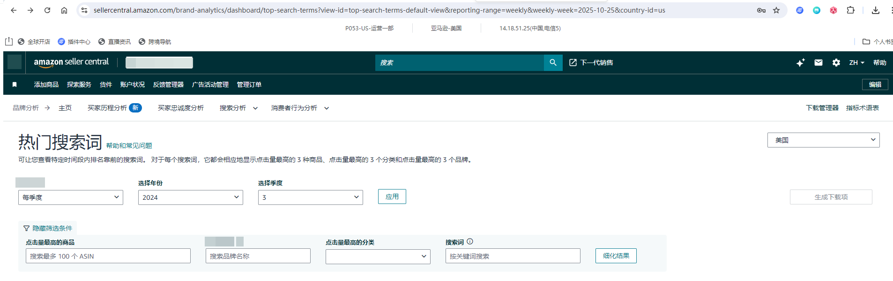
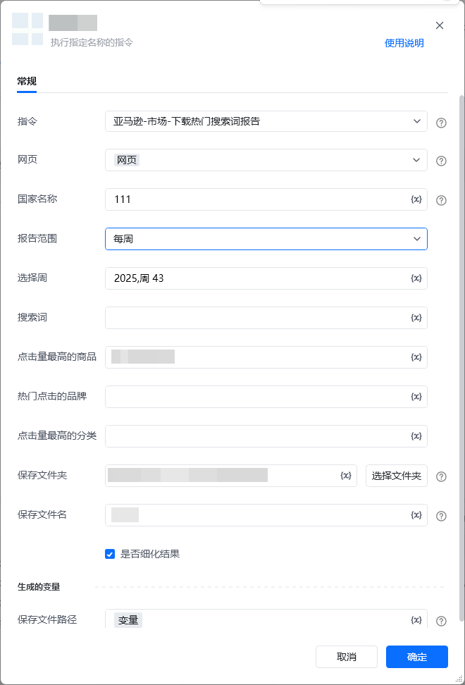

## 描述

该指令实现了亚马逊的热门搜索词页面中报告的下载
## 参数配置
### 指令输入

<strong>参数字段: </strong><em>类型；</em>参数描述
#### 常规

<strong>网页对象: </strong><em>web对象；</em>待操作的网页对象

<strong>国家名称: </strong><em>字符串；</em>国家的名称，例：美国

<strong>报告范围: </strong><em>字符串；</em>报告的日期范围，可选项：每日，每周，每月，每季度

<strong>选择日期: </strong><em>字符串；</em>仅报告范围为'每日'时填写，格式：YYYY/MM/DD

<strong>选择周: </strong><em>字符串；</em>仅报告范围为'每周'时填写，例：2025,周 43

<strong>选择年月: </strong><em>字符串；</em>仅报告范围为'每月'时填写，例如：2025,10 月

<strong>选择年季度: </strong><em>字符串；</em>仅报告范围为'每季度'时填写，例如：2025,1

<strong>点击量最高的商品: </strong><em>字符串；</em>商品的ASIN

<strong>热门点击品牌: </strong><em>字符串；</em>品牌的名称

<strong>点击量最高的分类: </strong><em>字符串；</em>分类的名称

<strong>搜索词: </strong><em>字符串；</em>搜索词的名称

<strong>保存文件夹: </strong><em>字符串；</em>下载文件保存的文件夹目录

<strong>保存文件名: </strong><em>字符串；</em>下载文件保存的文件名称

<strong>是否细化结果: </strong><em>布尔值；</em>是否点击细化结果按钮
### 指令输出

<strong>保存文件路径: </strong><em>字符串；</em>保存下载文件的路径
## 参考案例

<strong>场景描述</strong>

从亚马逊的热门搜索词页面中下载报告

https://sellercentral.amazon.com/brand-analytics/dashboard/top-search-terms[https://sellercentral.amazon.com/brand-analytics/dashboard/top-search-terms](https://sellercentral.amazon.com/brand-analytics/dashboard/top-search-terms)

<strong>参考流程</strong>

<strong>运行结果</strong>

<Info>
  使用指令过程中遇到问题？前往 [八爪鱼RPA 开发者社区问答板块](https://rpa.bazhuayu.com/community/questions) 提问，获取官方与社区帮助。
</Info>
