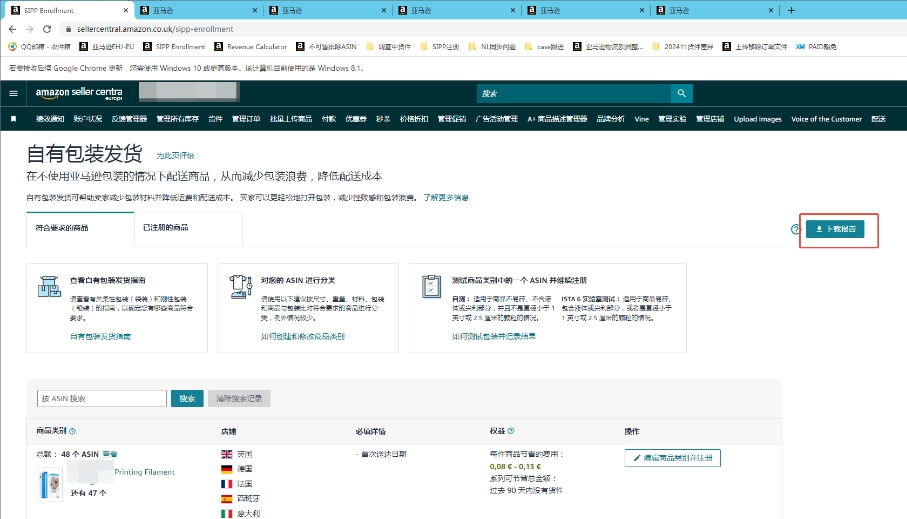
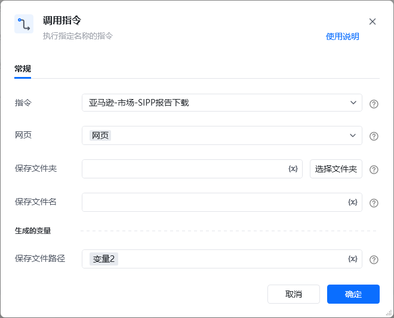

## 描述

该指令实现了亚马逊的自有包装发货页面中SIPP报告的下载
## 参数配置
### 指令输入

<strong>参数字段: </strong><em>类型；</em>参数描述
#### 常规

<strong>网页对象: </strong><em>web对象；</em>待操作的网页对象

<strong>保存文件夹: </strong><em>字符串；</em>下载文件保存的文件夹目录

<strong>保存文件名: </strong><em>字符串；</em>下载文件保存的文件名称
### 指令输出

<strong>保存文件路径: </strong><em>字符串；</em>保存文件的路径
## 参考案例
### 场景

https://sellercentral.amazon.com/sipp-enrollment[https://sellercentral.amazon.com/sipp-enrollment](https://sellercentral.amazon.com/sipp-enrollment)

<strong>关键指令配置</strong>

<strong>运行结果</strong>

<Info>
  使用指令过程中遇到问题？前往 [八爪鱼RPA 开发者社区问答板块](https://rpa.bazhuayu.com/community/questions) 提问，获取官方与社区帮助。
</Info>
