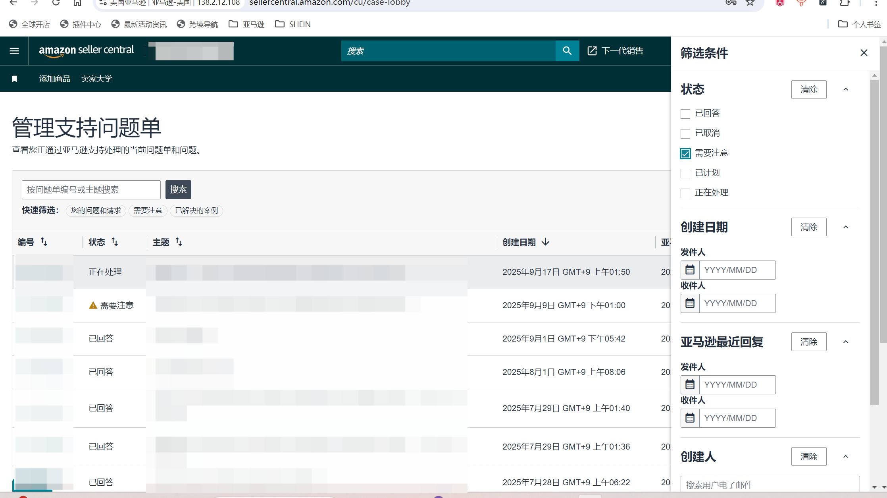
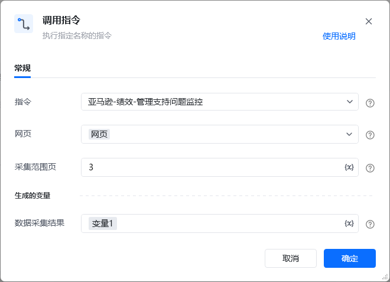
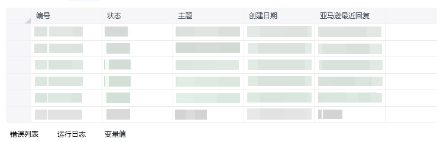

## 描述

该指令获取亚马逊管理支持问题单页的信息
## 参数配置
### 指令输入

<strong>参数字段: </strong><em>类型；</em>参数描述
#### 常规

<strong>网页：</strong><em>web对象,</em>待操作的网页对象

<strong>采集范围页：</strong>数值
### 指令输出

<em><strong>数据采集结果</strong></em><em>数据表格</em>
## 参考案例
### 场景

https://sellercentral.amazon.com/cu/case-lobby[https://sellercentral.amazon.com/cu/case-lobby](https://sellercentral.amazon.com/cu/case-lobby)
从亚马逊管理支持问题单页面获取需要注意的数据

<strong>参考流程</strong>

<strong>运行结果</strong>

<Info>
  使用指令过程中遇到问题？前往 [八爪鱼RPA 开发者社区问答板块](https://rpa.bazhuayu.com/community/questions) 提问，获取官方与社区帮助。
</Info>
