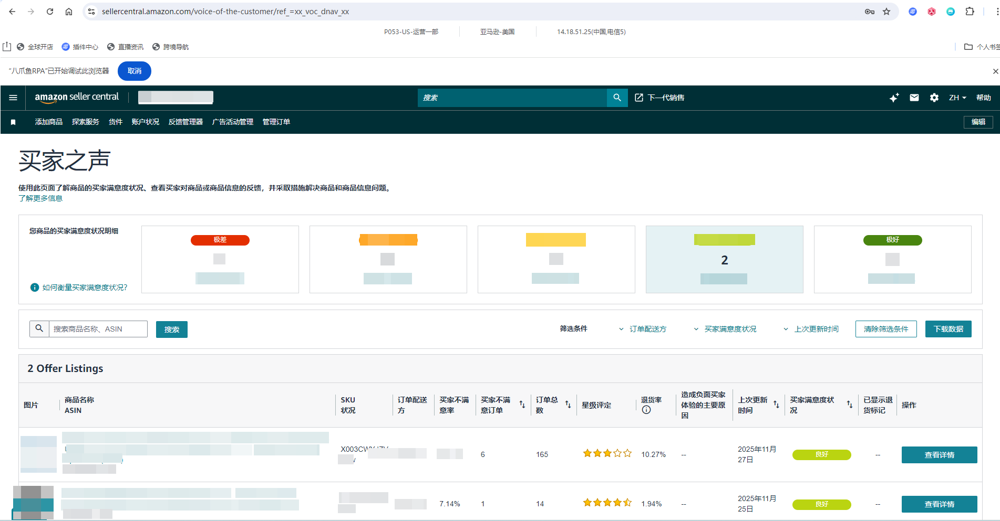
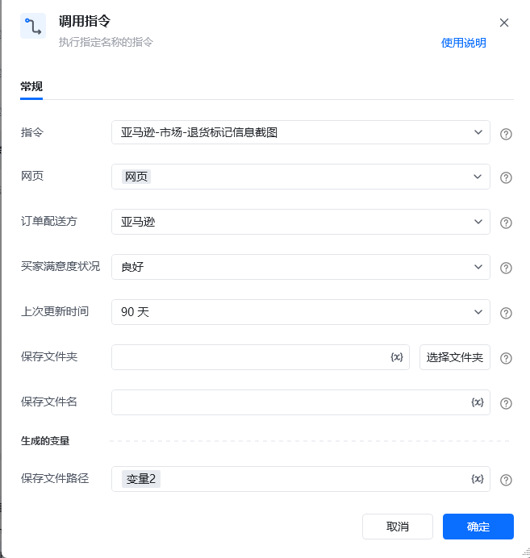

## <strong>描述</strong>

该指令实现了亚马逊中买家之声页面的退货标记信息截图
### 指令输入

<strong>参数字段: </strong><em>类型；</em>参数描述
#### 常规

<strong>网页对象: </strong><em>web对象；</em>待操作的网页对象

<strong>订单配送方: </strong><em>字符串；</em>订单配送方的名称，例：亚马逊 或者 卖家

<strong>买家满意度状况: </strong><em>字符串；</em>买家满意度状况的名称，例：极差，不合格，一般，良好，极好，反馈不足

<strong>上次更新时间: </strong><em>字符串；</em>上次更新时间的范围，例：7天，30天，90天，1年，全部

<strong>商品名称: </strong><em>字符串；</em>商品名称

<strong>保存文件夹: </strong><em>字符串；</em>导出文件保存的文件夹目录

<strong>保存文件名: </strong><em>字符串；</em>导出文件保存的文件名称
### 指令输出

<strong>保存文件路径: </strong><em>字符串；</em>保存文件的路径
### <strong>场景</strong>

https://sellercentral.amazon.com/voice-of-the-customer/ref_=xx_voc_dnav_xx[https://sellercentral.amazon.com/voice-of-the-customer/ref_=xx_voc_dnav_xx](https://sellercentral.amazon.com/voice-of-the-customer/ref_=xx_voc_dnav_xx)

<strong>关键指令配置</strong>

<strong>运行结果</strong>

<Info>
  使用指令过程中遇到问题？前往 [八爪鱼RPA 开发者社区问答板块](https://rpa.bazhuayu.com/community/questions) 提问，获取官方与社区帮助。
</Info>
