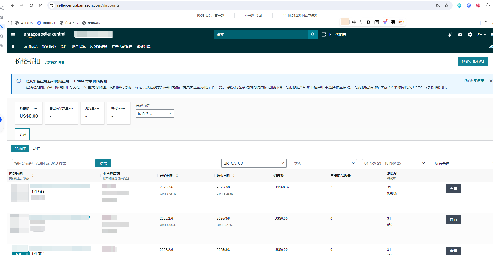
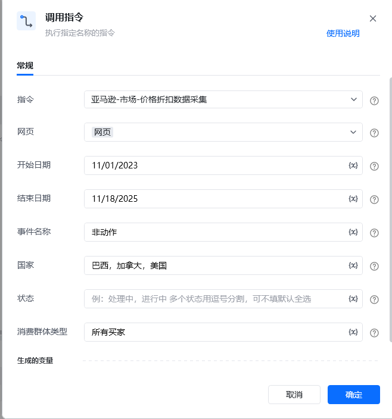
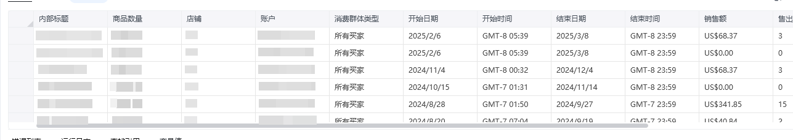

## <strong>描述</strong>

该指令实现了对亚马逊价格折扣页面的查询结果数据采集
### <strong>指令输入</strong>

<strong>参数字段: </strong><em>类型；</em>参数描述
#### <strong>常规</strong>

<strong>网页对象: </strong><em>web对象；</em>待操作的网页对象

<strong>事件名称: </strong><em>字符串；</em>事件的名称，可选项：非动作 或者 动作

<strong>国家名称: </strong><em>字符串；</em>国家的名称，例如：巴西

<strong>状态名称: </strong><em>字符串；</em>状态的名称，例如：注意事项

<strong>开始日期: </strong><em>字符串；</em>开始的日期，格式：MM/DD/YYYY，例如：11/01/2024

<strong>结束日期: </strong><em>字符串；</em>结束的日期，格式：MM/DD/YYYY，例如：11/01/2024

<strong>消费群体类型: </strong><em>字符串；</em>消费群体类型的名称，例如：所有买家
### <strong>指令输出</strong>

<strong>数据表格: </strong><em>数据表格；</em>
### <strong>场景</strong>
https://sellercentral.amazon.com/discounts[https://sellercentral.amazon.com/discounts](https://sellercentral.amazon.com/discounts) 

<strong>关键指令配置</strong>

<strong>运行结果</strong>

<Info>
  使用指令过程中遇到问题？前往 [八爪鱼RPA 开发者社区问答板块](https://rpa.bazhuayu.com/community/questions) 提问，获取官方与社区帮助。
</Info>
