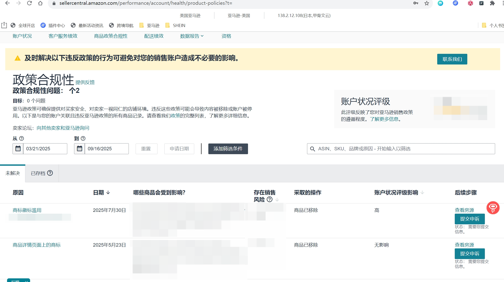
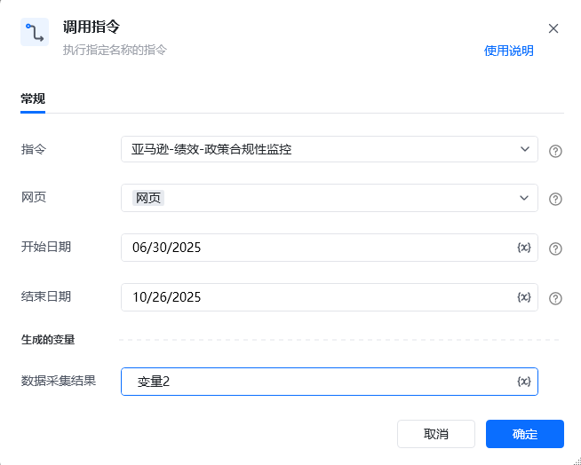
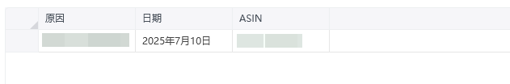

## 描述

该指令实现了获取亚马逊绩效中账户状况的政策合规性信息
## 参数配置
### 指令输入

<strong>参数字段: </strong><em>类型；</em>参数描述
#### 常规

<strong>网页: </strong><em>web对象；</em>待操作的网页对象

<strong>开始日期:</strong>起始日期,格式：MM/DD/YYYY

<strong>结束日期:</strong>截止日期,格式：MM/DD/YYYY
### 指令输出

<strong>数据采集结果: </strong>数据表格
## 参考案例
### 场景

https://sellercentral.amazon.com/performance/account/health/product-policies[https://sellercentral.amazon.com/performance/account/health/product-policies](https://sellercentral.amazon.com/performance/account/health/product-policies)

<strong>参考流程</strong>

<strong>运行结果</strong>

<Info>
  使用指令过程中遇到问题？前往 [八爪鱼RPA 开发者社区问答板块](https://rpa.bazhuayu.com/community/questions) 提问，获取官方与社区帮助。
</Info>
