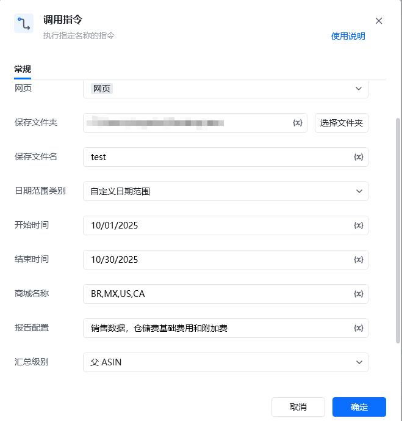
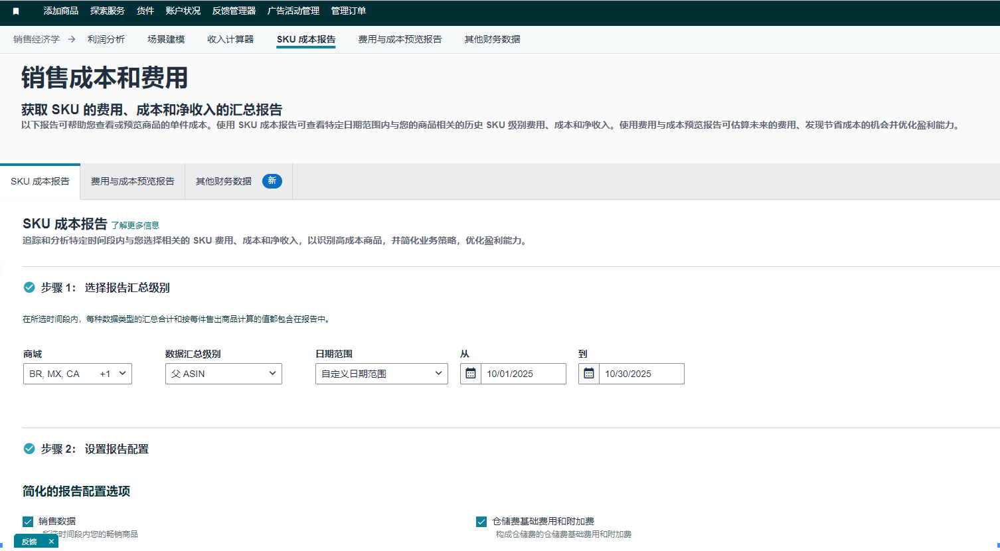

## 参数配置
### 指令输入
#### 常规

<strong>网页对象: </strong><em>web对象；</em>待操作的网页对象

<strong>保存文件夹: </strong><em>字符串；</em>导出文件保存的文件夹目录

<strong>保存文件名: </strong><em>字符串；</em>导出文件保存的文件名称，默认为商城名称+日期范围

<strong>日期范围类别: </strong><em>字符串；日期范围 类别</em>

<em><strong>日期格式</strong></em><em>：MM/dd/yyyy</em>

<strong>商城名称：</strong>例：BR,MX 多个用,隔开

<strong>报告配置: </strong><em>字符串；</em>报告汇总中的报告配置选项，多个用,隔开

<strong>汇总级别: </strong><em>字符串；</em>报告汇总中的数据汇总级别，默认为MSKU，支持父 ASIN和子 ASIN
### 指令输出

<strong>保存文件路径: </strong><em>字符串；</em>保存文件的路径
## 参考案例

<strong>场景描述</strong>

从亚马逊中下载SKU成本报告

<Info>
  使用指令过程中遇到问题？前往 [八爪鱼RPA 开发者社区问答板块](https://rpa.bazhuayu.com/community/questions) 提问，获取官方与社区帮助。
</Info>
