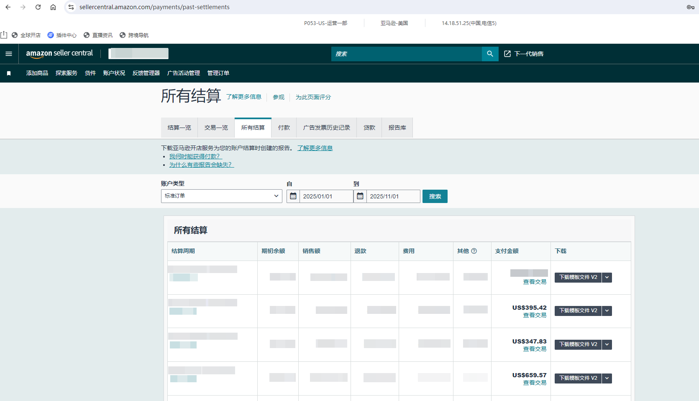
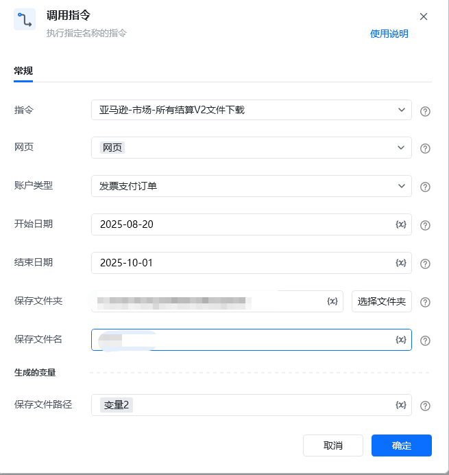

## <strong>描述</strong>

该指令实现了对亚马逊所有结算V2文件的下载
### <strong>指令输入</strong>

<strong>参数字段: </strong><em>类型；</em>参数描述
#### <strong>常规</strong>

<strong>网页对象: </strong><em>web对象；</em>待操作的网页对象

<strong>账户类型: </strong><em>字符串；</em>报告的账户类型，默认：标准订单

<strong>开始日期: </strong><em>字符串；</em>报告的开始日期，格式：yyyy-mm-dd，例如：2025-01-01

<strong>结束日期: </strong><em>字符串；</em>报告的结束日期，格式：yyyy-mm-dd，例如：2025-08-21

<strong>保存文件夹: </strong><em>字符串；</em>下载文件保存的文件夹目录

<strong>保存文件名: </strong><em>字符串；</em>下载文件保存的文件名称，默认：站点名称+结算周期
### <strong>指令输出</strong>

<strong>保存文件路径: </strong><em>字符串；</em>保存下载文件的路径
### <strong>场景</strong>

https://sellercentral.amazon.com/payments/past-settlements[https://sellercentral.amazon.com/payments/past-settlements](https://sellercentral.amazon.com/payments/past-settlements)

<strong>关键指令配置</strong>

<strong>运行结果</strong>

<Info>
  使用指令过程中遇到问题？前往 [八爪鱼RPA 开发者社区问答板块](https://rpa.bazhuayu.com/community/questions) 提问，获取官方与社区帮助。
</Info>
