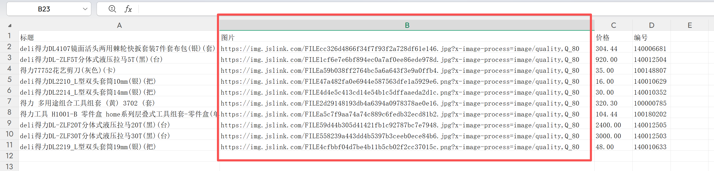
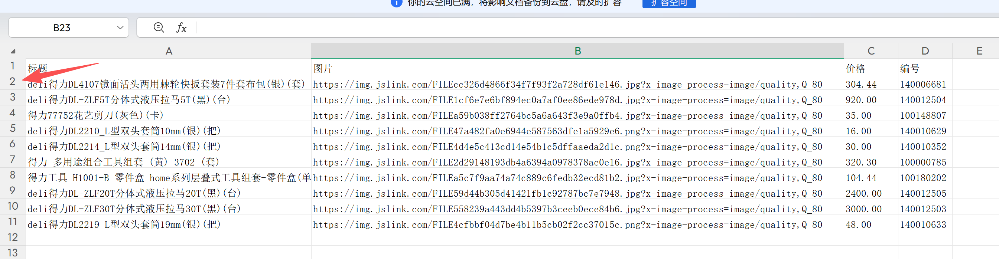
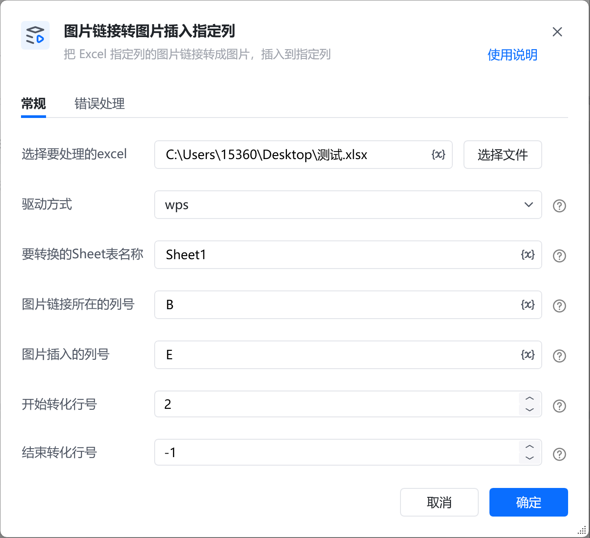
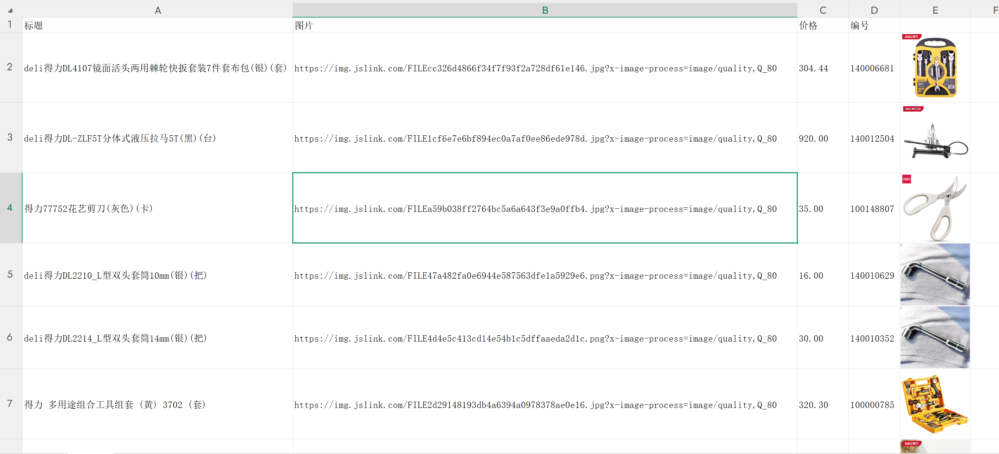

# 描述

把 Excel 指定列的图片链接转成图片，插入到指定列(仅支持wps)
# 配置说明
## 输入

<strong>选择要处理的excel:</strong>

选择需要处理的excel

<strong>要转换的Sheet表名称:</strong>

填写要转换的Sheet表名称，例如：Sheet1

<strong>图片链接所在的列号:</strong>

填写图片链接所在的列号，例如：B

<strong>图片插入的列:</strong>

填写图片插入的列号，例如：C

<strong>开始转化行号:</strong>

填写你想开始转化的行号，例如：2（一般第1行为表头，所以从2行开始）

<strong>结束转化行号:</strong>

填写你想结束转化的行号，例如：10（若想转化全部，可填-1）
## 输出

该指令无参数输出
## 使用示例

<Info>
  使用指令过程中遇到问题？前往 [八爪鱼RPA 开发者社区问答板块](https://rpa.bazhuayu.com/community/questions) 提问，获取官方与社区帮助。
</Info>
